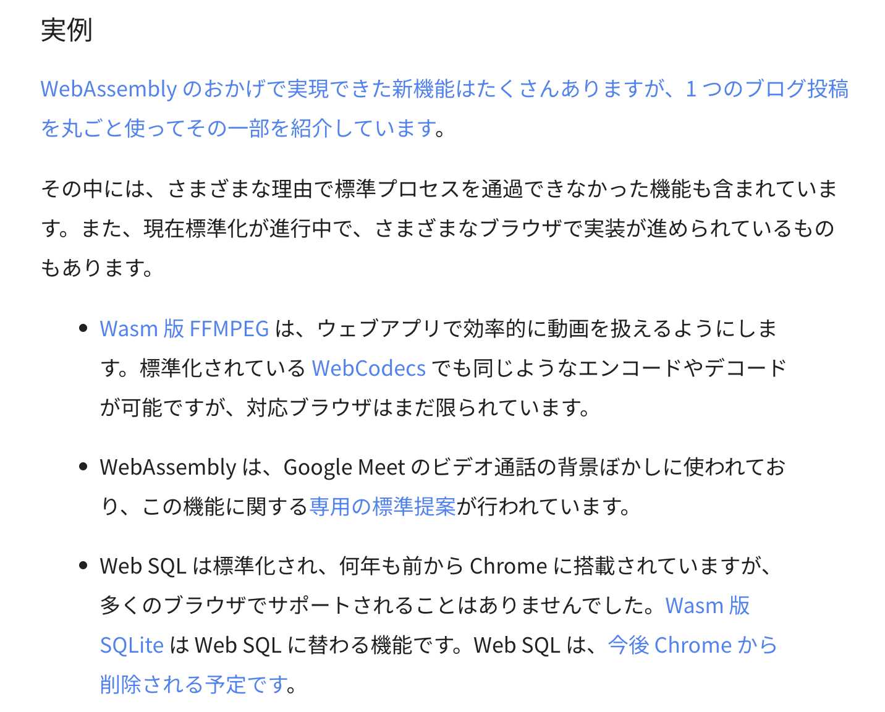
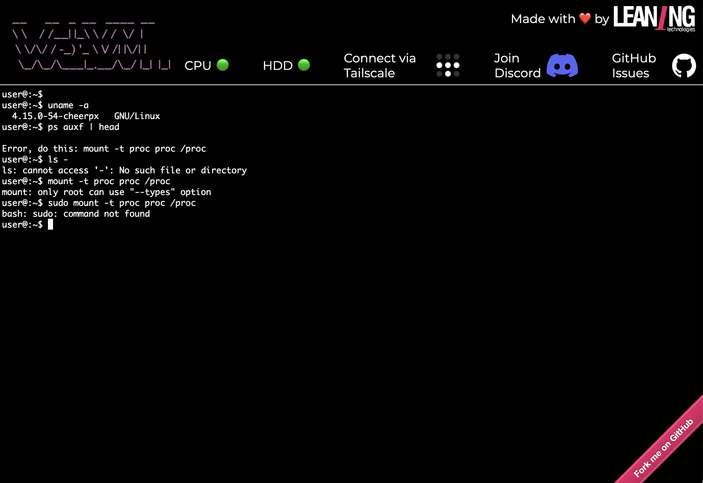

----
marp: true
title: "WebAssemblyでScratchプラグインを作ろう!"
description: "At Engineer Cafe Lab Fukuoka 2024/10"
header: "WebAssemblyでScratchプラグインを作ろう!"
footer: "#1 Our First WebAssembly Run"
theme: ecl
image: https://udzura.jp/engineer-cafe-lab-wasm-course/2024-25/01_whatiswasm/ogp.png#TODO
paginate: true
----

<!--
_class: hero
-->

# WebAssemblyで<br>Scratchプラグインを作ろう!

## #1 Our First WebAssembly Run

----

# 今日やるゴール

- WebAssemblyとは？
- WASM のバイナリ構造・セクションについて（初級）
- 手元でWASMを動かす
  - その1
  - その2 / WASIの触り
- ブラウザで動かす
- importとexportの話をする
  - ブラウザで連携するには？

----

<!--
_class: hero
-->

# WebAssembly(WASM)の概要

----

# WebAssembly ってそもそも何？

* なんか... ブラウザで動くやつ...
* 「ブラウザ上でJS以外の言語を動かすことができる技術」
  - 最近使われてるらしい
  - Ruby、Python、Kotlin、他色々対応しつつあるらしい
* WASMとも呼ばれる。だいたい同じものを指す

----

# 具体的なユースケースから

- Unity3d
- Goolge Meet
- Figma（[高速化の事例](https://www.figma.com/ja-jp/blog/webassembly-cut-figmas-load-time-by-3x/)）
- Linux on browser, ...

----

# Unity3d

- 3Dゲームをブラウザで動かすことができる
  - そこでWASMを使っている
- https://docs.unity3d.com/ja/2022.1/Manual/webgl-native-plugins-with-emscripten.html

----

# Goolge Meet

- ビデオ通話の背景ぼかしに利用
- https://developers-jp.googleblog.com/2023/05/webassembly.html


　

----

# Linux on Browser

- [webvm.io](https://webvm.io/)



----

# WASMが得意なこと

- 高速な処理
- 言語を選ばず実装可能
- ポータブル（ブラウザでもサーバでも組み込んで動く）

----

# ブラウザの外で動く例

- wasmで設定を書く（ロードバランサーのenvoyほか）
  - https://github.com/envoyproxy/envoy-wasm
  - https://docs.fluentbit.io/manual/pipeline/filters/wasm
- wasmプログラムををコンテナとして動かす
  - [kubernetesの下でwasmを動かす](https://krustlet.dev/)

----

# WASMの作り方

- Rustのwasm backend
  - wasm_bindgenのようなツール/SDKも豊富
- emscripten
  - C/C++ をwasmにする、ブラウザとのグルー部分も生成する
- AssemblyScript
  - TypeScript のサブセット
- 各言語での個別の対応
  - Ruby、Python、Go、Kotlin、Swift...

----

<!--
_class: hero
-->

# WASM のバイナリ構造とセクション

- 概要の次でいきなりバイナリの話かよ！

----

# WASM のサンプルバイナリ

- とりあえずダウンロードしてみよう

```
wget \
  https://github.com/udzura/engineer-cafe-lab-wasm-course/raw/refs/heads/master/samples/hello_wasm.wasm
```

----

# WASM の「中身」を確認するコマンド

- `wasm-objdump` （WABTに含まれる）を使う

```
wasm-objdump -x hello_wasm.wasm
# たくさん表示されるので、grep、lessなど組み合わせる
```

----

# WASM バイナリ（モジュール）の構造

- 先頭8バイトのプリアンブル
  - Magic Number + version
- その後ろにセクションが複数存在


----

# WASM バイナリのセクション

```
$ wasm-objdump -x /hello_wasm.wasm | grep -E '^[A-Z]'
Section Details:
Type[13]:
Import[1]:
Function[54]:
Table[1]:
Memory[1]:
Global[3]:
Export[4]:
Elem[1]:
Code[54]:
Data[1]:
Custom:
...
```

----

# 例えばImport？

- `-j` オプションで特定のセクションを表示

```
$ wasm-objdump -x -j Import hello_wasm.wasm       

hello_wasm.wasm:	file format wasm 0x1
module name: <hello_wasm.wasm>

Section Details:

Import[1]:
 - func[0] sig=3 <hoge> <- env.hoge
```

----

# セクションの例

- 代表的なもののみ [ref](https://webassembly.github.io/spec/core/binary/modules.html)

| Name | 詳細 |
| --- | --- |
| Type     | 使う型・シグネチャの定義 | 
| Function | 定義されている関数定義 | 
| Table    | 関数のロケーションなど、線型メモリ外のオブジェクトの配置情報 | 
| Memory   | 線形メモリの情報を宣言 | 
| Global   | グローバル変数など | 

----

# セクションの例(2)

- 代表的なもののみ [ref](https://webassembly.github.io/spec/core/binary/modules.html)

| Name | 詳細 |
| --- | --- |
| Import   | 実行時にimport必要な関数の情報 | 
| Export   | exportされている関数の情報 | 
| Elem     | インスタンス化時に参照するテーブルのエレメントを宣言 | 
| Code     | WASMの実際のバイトコード部分 | 
| Data     | プログラムで使う初期化済みデータ | 


----

<!--
_class: hero
-->

# WASM を作って動かそう

----

# My first project

```
$ cargo new hello-wasm --lib
$ cd hello-wasm
```

----

# ビルド設定を少し編集する

```
$ code Cargo.toml
```

```toml
[package]
name = "hello-wasm"
version = "0.1.0"
edition = "2021"

[dependencies]

[lib] # ここを変更
crate-type = ["cdylib", "rlib"]
```

----

# 関数を実装してみよう

```
$ code src/lib.rs
```

- 自動生成されたコードを一通り消して、これだけにする

```rust
#[no_mangle]
pub fn add(left: i32, right: i32) -> i32 {
    left + right
}
```

----

# ビルドしよう

```
$ cargo build --target wasm32-unknown-unknown
...
hello-wasm/Cargo.toml
   Compiling hello-wasm v0.1.0 (/Users/udzura/hello-wasm)
    Finished `dev` profile [unoptimized + debuginfo] target(s) in 0.90s

$ file ./target/wasm32-unknown-unknown/debug/hello_wasm.wasm 
.../hello_wasm.wasm: WebAssembly (wasm) binary module version 0x1 (MVP)
```

----

# wasmtime で動作確認する

```bash
$ wasmtime --invoke add ./target/wasm32-unknown-unknown/debug/hello_wasm.wasm 1 2 
# warning: using `--invoke` with a function
#   that takes arguments is experimental and may break in the future...
3
```

----

# 今度は「main」を実装しよう

- `Cargo.toml` の `[lib]` を以下に変更

```toml
[lib]
# crate-type = ["cdylib", "rlib"]
crate-type = ["lib"]
```

- `src/main.rs` を作成

```rust
fn main() {
    println!("Hello Engineer Cafe!")
}
```

----

# ビルドしよう

```
$ cargo build --target wasm32-wasi
...
    Finished `dev` profile [unoptimized + debuginfo] target(s) in 0.05s
```

----

# wasmtimeで動かす

```
$ wasmtime ../../target/wasm32-wasi/debug/hello-wasm.wasm 
Hello Engineer Cafe!
```

※ なぜかバイナリ名がさっきと違う。cargoの規約？と思われるのでスルー

----

# 2つのwasmバイナリの違い

### add

```
Export[4]:
 - memory[0] -> "memory"
 - func[0] <add> -> "add"
 - global[1] -> "__data_end"
 - global[2] -> "__heap_base"
```

### hello

```
Export[3]:
 - memory[0] -> "memory"
 - func[5] <_start> -> "_start"
 - func[7] <__main_void> -> "__main_void"
```

----

# 2つのwasmバイナリの違い

### add

```
Section not found: Import
```

### hello

```
Import[4]:
 - func[0] sig=7 <_ZN4wasi13lib_generated...> <- wasi_snapshot_preview1.fd_write
 - func[1] sig=4 <__imported_wasi_...> <- wasi_snapshot_preview1.environ_get
 - func[2] sig=4 <__imported_wasi_...> <- wasi_snapshot_preview1.environ_sizes_get
 - func[3] sig=1 <__imported_wasi_...> <- wasi_snapshot_preview1.proc_exit
```

----

# WASI？ ワシには難しくて...

- WASIとは何か？を踏み込んだところは一旦保留して先に進みます

----

<!--
_class: hero
-->

# ブラウザで動かそう


----

# first project の方のバイナリを使う

----

# index.html を作ろう


----

# instanciateとはなんぞや？

----

# 手元にサーバを立てて確認しよう

```
cd

# 手元にRubyが入ってる人はこっちでもOKです
# 講師はRubyの方が慣れてるので手癖でこっちを叩きますが、お好きな方で
ruby -run -e httpd -- .
```

----

# fibを計算できました！


----

<!--
_class: hero
-->

# importとexport

----

# 少し高度な話に入ります


----

# まずは: 先ほどの「hello world」

- 文字列を出力する方のwasmバイナリをブラウザで動かしてみる

----

# エラーになります

----

# エラーメッセージを覚えておいてください

----

# importとexportの話


----

# importとexportを使うコードを書いてみよう


----

# まずはビルドしてみよう

----

# セクションを確認してみよう


----

# これをブラウザで使うには？

- 前のコードだとこういうエラーが出る

----

# importObject とは？


----

# 「コールバック」をwasmに渡してみよう

----

# 動作確認

----

# じゃあ、WASIとは結局何？

- 「OSのような環境」で動かすためにあらかじめ規定されたimport関数のセット、と見なすことができる
  - まさにPOSIXのような感じ

----

# ブラウザを「WASI対応させる」

- WASIのimport関数を実装したものをブラウザで用意すればいい
- 例えば:
  - wasi_shim

----

# さっきの「hello world」に再挑戦

----

<!--
_class: hero
-->

# まとめ

----

# 今日のまとめ

## 以下のような内容を学んだはず

- WASM
- WASMのビルドの仕方
- WASMの動かし方（コマンド、ブラウザ）
- 関数のimport/exportの基本
  - WASIの触りも確認した

----

# 次回

- #2 WebAssembly モジュールとブラウザを連携させよう
  - <span style='font-size: 30pt'>予定: 11/23(土) 14:00 start</span>
  - キーワード:
    - 文字列
    - 線形メモリ
