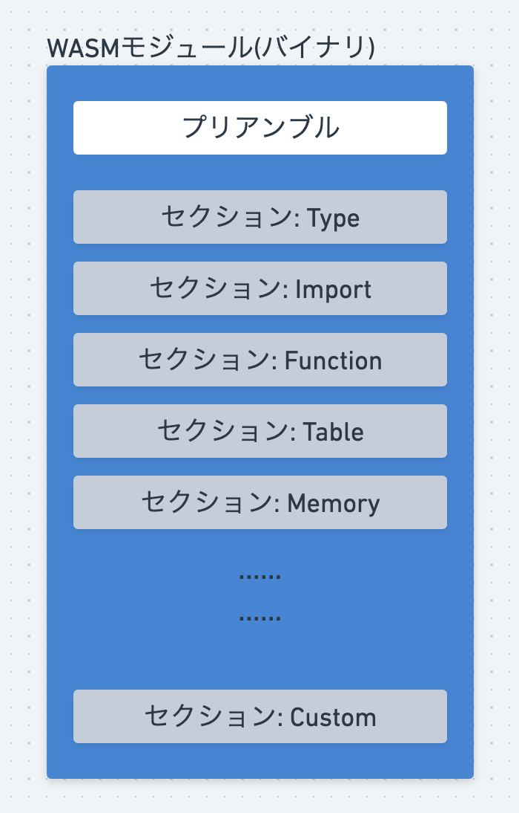

----
marp: true
title: "WebAssemblyでScratchプラグインを作ろう!"
description: "At Engineer Cafe Lab Fukuoka 2024/10"
header: "WebAssemblyでScratchプラグインを作ろう!"
footer: "#1 Our First WebAssembly Run"
theme: ecl
image: https://udzura.jp/engineer-cafe-lab-wasm-course/2024-25/01_whatiswasm/ogp.png
paginate: true
----

<!--
_class: hero
-->

# WebAssemblyで<br>Scratchプラグインを作ろう!

## #1 Our First WebAssembly Run

----

<!--
_class: profile
-->

# Uchio Kondo (@udzura)

- 福岡市エンジニアカフェ ハッカーサポーター
- フィヨルドブートキャンプ アドバイザー
- [RubyKaigi Speaker (2016 ~)](https://rubykaigi-speakers.vercel.app/speakers/Uchio+KONDO)
- 共同翻訳: 『入門eBPF』(オライリージャパン)
- 好きなYouTuber: けんた食堂


----

### 最近やってること: 自作 WASM Runtime

[](https://x.com/udzura/status/1850203383313080686)

----

# 今日やること

- WebAssemblyとは？
- WASM のバイナリ構造・セクションについて概要
- 手元でWASMを動かす
  - その1
  - その2 (WASI)
- ブラウザで動かす
- importとexportの話をする
  - ブラウザで連携するには？
  - WASIの理解

----

<!--
_class: hero
-->

# WebAssembly(WASM)の概要

----

# WebAssembly ってそもそも何？

* なんか... ブラウザで動くやつ...
* 「ブラウザ上でJS以外の言語を動かすことができる技術」
  - 最近使われてるらしい
  - Ruby、Python、Kotlin、他色々対応しつつあるらしい
* WASMとも呼ばれる。だいたい同じものを指す

----

# 具体的なユースケースから

- Unity3d
- Goolge Meet
- Figma（[高速化の事例](https://www.figma.com/ja-jp/blog/webassembly-cut-figmas-load-time-by-3x/)）
- Linux on browser, ...

----

# Unity3d

- 3Dゲームをブラウザで動かすことができる
  - そこでWASMを使っている
- https://docs.unity3d.com/ja/2022.1/Manual/webgl-native-plugins-with-emscripten.html

----

# Goolge Meet

- ビデオ通話の背景ぼかしに利用
- https://developers-jp.googleblog.com/2023/05/webassembly.html


　

----

# Linux on Browser

- [webvm.io](https://webvm.io/)


----

# WASMが得意なこと

- 高速な処理
- 言語を選ばず実装可能
- ポータブル（ブラウザでもサーバでも組み込んで動く）

----

# ブラウザの外で動く例

- WASMで設定を書く（ロードバランサーのenvoyほか）
  - https://github.com/envoyproxy/envoy-wasm
  - https://docs.fluentbit.io/manual/pipeline/filters/wasm
- WASMプログラムをコンテナとして動かす
  - [kubernetesの下でWASMを動かす](https://krustlet.dev/)

----

# WASMの作り方

- RustのWASM backend
  - wasm_bindgenのようなツール/SDKも豊富
- emscripten
  - C/C++ をWASMにする、ブラウザとのグルー部分も生成する
- AssemblyScript
  - TypeScript のサブセット
- 各言語での個別の対応
  - Ruby、Python、Go、Kotlin、Swift...

----

<!--
_class: hero
-->

# WASM のバイナリ構造とセクション

- 概要の次でいきなりバイナリの話かよ！

----

# WASM のサンプルバイナリ

- とりあえずダウンロードしてみよう

```
wget \
  https://github.com/udzura/engineer-cafe-lab-wasm-course/raw/refs/heads/master/samples/hello_wasm.wasm
```

----

# WASM の「中身」を確認するコマンド

- `wasm-objdump` （WABTに含まれる）を使う

```
wasm-objdump -x hello_wasm.wasm
# たくさん表示されるので、grep、lessなど組み合わせる
```

----

# WASM バイナリ（モジュール）の構造

- 先頭8バイトのプリアンブル
  - Magic Number + version
- その後ろにセクションが複数存在



<!--
モジュールは後からも出てきて、モジュールって何だよ！という質問が出てきそうだけど
WASMの文脈においては「互いに呼び合える、関数を束ねたもの」ぐらいの概念と思っておけば良さそう
なので、WASMで実装した関数の塊もモジュールだし、
JavaScript側でオブジェクトに束ねたものもモジュール。

ES Moduleと比較すると良さそうだけど、識者の意見を聞きたい感じ...
-->

----

# WASM バイナリのセクション

```
$ wasm-objdump -x /hello_wasm.wasm | grep -E '^[A-Z]'
Section Details:
Type[13]:
Import[1]:
Function[54]:
Table[1]:
Memory[1]:
Global[3]:
Export[4]:
Elem[1]:
Code[54]:
Data[1]:
Custom:
...
```

----

# 例えばImport？

- `-j` オプションで特定のセクションを表示

```
$ wasm-objdump -x -j Import hello_wasm.wasm       

hello_wasm.wasm:	file format wasm 0x1
module name: <hello_wasm.wasm>

Section Details:

Import[1]:
 - func[0] sig=3 <hoge> <- env.hoge
```

----

# セクションの例

- 代表的なもののみ [ref](https://webassembly.github.io/spec/core/binary/modules.html)

| Name | 詳細 |
| --- | --- |
| Type     | 使う型・シグネチャの定義 | 
| Function | 定義されている関数定義 | 
| Table    | 関数のロケーションなど、線型メモリ外のオブジェクトの配置情報 | 
| Memory   | 線形メモリの情報を宣言 | 
| Global   | グローバル変数など | 

----

# セクションの例(2)

- 代表的なもののみ [ref](https://webassembly.github.io/spec/core/binary/modules.html)

| Name | 詳細 |
| --- | --- |
| Import   | 実行時にimport必要な関数の情報 | 
| Export   | exportされている関数の情報 | 
| Elem     | インスタンス化時に参照するテーブルのエレメントを宣言 | 
| Code     | WASMの実際のバイトコード部分 | 
| Data     | プログラムで使う初期化済みデータ | 


----

<!--
_class: hero
-->

# WASM を作って動かそう

----

# My first project

```
$ cargo new hello-wasm --lib
$ cd hello-wasm
```

----

# ビルド設定を少し編集する

```
$ code Cargo.toml
```

```toml
[package]
name = "hello-wasm"
version = "0.1.0"
edition = "2021"

[dependencies]

[lib] # ここを変更
crate-type = ["cdylib", "rlib"]
```

----

# 関数を実装してみよう

- `src/lib.rs` のコードを一通り消して、これだけにする

```rust
#[no_mangle]
pub fn fib(n: i32) -> i32 {
    match n {
        ..=-1 => {
            0
        }
        ..=1 => {
            1
        }
        _ => {
            fib(n-1) + fib(n-2)
        }
    }
}
```

----

# Rustすぎる...場合

- こう書いても同じ結果です

```rust
#[no_mangle]
pub fn fib(n: i32) -> i32 {
    if n <= -1 {
        return 0;
    }
    if n <= 1 {
        return 1;
    }
    return fib(n-1) + fib(n-2);
}
```

----

# ビルドしよう

```
$ cargo build --target wasm32-unknown-unknown
...
hello-wasm/Cargo.toml
   Compiling hello-wasm v0.1.0 (/Users/udzura/hello-wasm)
    Finished `dev` profile [unoptimized + debuginfo] target(s) in 0.90s

$ file ./target/wasm32-unknown-unknown/debug/hello_wasm.wasm 
.../hello_wasm.wasm: WebAssembly (wasm) binary module version 0x1 (MVP)
```

----

# wasmtime で動作確認する

```bash
$ wasmtime --invoke fib ./target/wasm32-unknown-unknown/debug/hello_wasm.wasm 20 
# warning: using `--invoke` with a function
#   that takes arguments is experimental and may break in the future...
10946
```

----

# 今度は「main」を実装しよう

- `Cargo.toml` の `[lib]` を以下に変更

```toml
[lib]
# crate-type = ["cdylib", "rlib"]
crate-type = ["lib"]
```

- `src/main.rs` を作成

```rust
fn main() {
    println!("Hello Engineer Cafe!")
}
```

----

# ビルドしよう

```
$ cargo build --target wasm32-wasi
...
    Finished `dev` profile [unoptimized + debuginfo] target(s) in 0.05s
```

----

# wasmtimeで動かす

```
$ wasmtime ./target/wasm32-wasi/debug/hello-wasm.wasm 
Hello Engineer Cafe!
```

※ なぜかバイナリ名がさっきと違う。cargoの規約？と思われるのでスルー

----

# 2つのWASMバイナリの違い

### fib

```
Export[4]:
 - memory[0] -> "memory"
 - func[0] <fib> -> "fib"
 - global[1] -> "__data_end"
 - global[2] -> "__heap_base"
```

### hello

```
Export[3]:
 - memory[0] -> "memory"
 - func[5] <_start> -> "_start"
 - func[7] <__main_void> -> "__main_void"
```

----

# 2つのWASMバイナリの違い

### fib

```
Section not found: Import
```

### hello

```
Import[4]:
 - func[0] sig=7 <_ZN4wasi13lib_generated...> <- wasi_snapshot_preview1.fd_write
 - func[1] sig=4 <__imported_wasi_...> <- wasi_snapshot_preview1.environ_get
 - func[2] sig=4 <__imported_wasi_...> <- wasi_snapshot_preview1.environ_sizes_get
 - func[3] sig=1 <__imported_wasi_...> <- wasi_snapshot_preview1.proc_exit
```

----

# WASI？ ワシには難しくて...

- WASI = WebAssembly System Interface
- では、WASIとは何か？を踏み込んだところは一旦保留して
  - 先に進みます

----

<!--
_class: hero
-->

# ブラウザで動かそう


----

# first project の方のバイナリを使う

- `target/wasm32-unknown-unknown/debug/hello_wasm.wasm` の方を使う
  - `fib()` を実装した方です
- `web` というディレクトリを新たに作ってそこへコピー

```
$ mkdir web
$ cp target/wasm32-unknown-unknown/debug/hello_wasm.wasm web
```

----

# index.html を作ろう

- `web/index.html` を編集

```html
<html><head>
    <title>My first WASM</title>
    <script async type="text/javascript">
        const obj = {
            env: {},
        };
        WebAssembly.instantiateStreaming(fetch("./hello_wasm.wasm"), obj).then(
            (obj) => {
                let answer = obj.instance.exports.fib(20);
                alert("answer: fib(20) = " + answer.toString());
                console.log("debug: it works!");
            },
        );
    </script></head>
    <body><h1>Wasm working on browser</h1></body>
</html>
```

----

# instantiateとはなんぞや？

- [MDN: `WebAssembly.instantiateStreaming()`](https://developer.mozilla.org/ja/docs/WebAssembly/JavaScript_interface/instantiateStreaming_static)

> `WebAssembly.instantiateStreaming()` 関数は、ソースのストリームから直接 WebAssembly モジュールをコンパイルしてインスタンス化します。これは、 WASMコードをロードするための最も効率的で最適な方法です。

- 2つの引数: `source`, `importObject`
- プロミスを返すので、WASMをロードしてからの処理をつなげる

----

# 手元にサーバを立てて確認しよう

```
$ cd web
$ python3 -m http.server 8080

# 手元にRubyが入ってる人はこっちでもOKです
# お好きな方で
$ ruby -run -e httpd -- .
```

- http://localhost:8080/ にアクセス

----

# ブラウザで<br>fibを計算できました！


----

<!--
_class: hero
-->

# シン・importとexport

----

# 少し高度な話に入ります


----

# まずは: 先ほどの「hello world」

- 文字列を出力する方のWASMバイナリをブラウザで動かしてみる
- fibが動いたけん楽勝やろ？
- 同じように web ディレクトリにコピーし、 index.html を加工してロードする

```
$ cp ./target/wasm32-wasi/debug/hello-wasm.wasm web/hello2.wasm
```

```javascript
WebAssembly.instantiateStreaming(fetch("./hello2.wasm"), obj).then(
    (obj) => {
        // ロードOKだけログに出してみよう
        console.log("debug: load OK!");
    },
);
```

----

# エラーになります


----

# エラーメッセージを覚えておいてください

```
Uncaught (in promise) TypeError: WebAssembly.instantiate():
Import #0 "wasi_snapshot_preview1": module is not an object or function
```

----

# importとexportの話

- エラーメッセージを翻訳すると: **Import** すべきモジュールが指定されていない
- さっきは不要だったけど、なぜ？
- 逆に対になる **Export** もあるけど、つまりこれは何？

```javascript
// What is exports ??
let answer = obj.instance.exports.fib(20);
```

----

# importとexportを使うコードを書いてみよう

- あえて両方を使ってみる
- 混乱しないように新しいcrateを作っておこう

```
$ cargo new --lib hello-more
$ cd hello-more
$ code Cargo.toml # 前のスライド参照
$ code src/lib.rs
```

----

```rust
extern "C" {
    fn my_callback(n: i32);
}

#[no_mangle]
pub unsafe fn fib(n: i32) -> i32 {
    let r = match n {
        ..=-1 => {
            0
        }
        ..=1 => {
            1
        }
        _ => {
            fib(n-1) + fib(n-2)
        }
    };
    my_callback(r);
    r
}
```

----

# まずはビルドしてみよう

```
$ cargo build --target wasm32-unknown-unknown
```

----

# セクションを確認してみよう

```
$ wasm-objdump -x -j Export ./target/wasm32-unknown-unknown/debug/hello_more.wasm 
# or Import

Export[4]:
 - memory[0] -> "memory"
 - func[1] <fib> -> "fib"
 - global[1] -> "__data_end"
 - global[2] -> "__heap_base"

Import[1]:
 - func[0] sig=3 <my_callback> <- env.my_callback
```

----

# これをブラウザで使うには？

- 前のコード（`fib()` を実行した時のhtml）をそのまま流用して動かしてみる
- （また）こういうエラーが出る

```
index.html:1 Uncaught (in promise) TypeError: WebAssembly.instantiate(): 
Import #0 "env": module is not an object or function
```

----

# importObject 引数の話

- `instantiateStreaming()` の2番目の引数 `importObject` を経由して関数を渡すことができる

```javascript
const importObject = {
    env: { .... },
};
WebAssembly.instantiateStreaming(
    fetch("./hello.wasm"),
    importObject, // <- Here
).then(...)
```

----

# 「コールバック」をWASMに渡してみよう

```javascript
const obj = {
    // モジュール名
    env: {
        // これがコールバック
        my_callback: function (value) {
            console.log("callback value = " + value.toString());
        }
    },
};
WebAssembly.instantiateStreaming(fetch("./hello3.wasm"), obj).then(
    (obj) => {
        let answer = obj.instance.exports.fib(20);
        console.log("answer: fib(20) = " + answer.toString());
    },
);
```

----

# 動作確認


----

# ところで

- 「WASIについては置いておきましょう」と言いました
  - この段階で、WASIについて理解するための道具が整理できました
- 少しだけ寄り道してみましょう

----

# 改めて: WASI

- 教科書的説明

> Webブラウザ以外の実行環境において、WebAssemblyに備わっていることが望ましいさまざまなシステムインターフェイスを策定し実現するもの -- [Publickey](https://www.publickey1.jp/blog/19/webassemblywebwasimozillanodejs.html)

- WASMからシステムへのインタフェースの規約


----

# WASIとは結局何？

- 「OSのような環境」で動かすためにあらかじめ規定されたimport関数のセット(=モジュール)、と見なすことができる
  - まさにPOSIXのような感じ

----

# 「WASI対応」とは結局

- システムに合わせて、import用の関数のセットを実装することに他ならない


----

# ブラウザを「WASI対応」させる

- WASIのimport関数を実装したものをブラウザで用意すればいい
  - 不要なものは何ならダミーでもいい
- OSSでもいくつか存在する
- 例えば:
  - [browser_wasi_shim](https://github.com/bjorn3/browser_wasi_shim)

----

# さっきの「hello world」に再挑戦

```html
<script type="module">
    import {WASI, File, OpenFile, ConsoleStdout} 
      from 'https://cdn.jsdelivr.net/npm/@bjorn3/browser_wasi_shim@0.3.0/+esm'
    const fds = [
        new OpenFile(new File([])), // 0
        ConsoleStdout.lineBuffered(msg => console.log(`[WASI stdout] ${msg}`)), // 1
        ConsoleStdout.lineBuffered(msg => console.warn(`[WASI stderr] ${msg}`)), // 2
    ];
    const wasi = new WASI([], [], fds);
    const obj = {
        "wasi_snapshot_preview1": wasi.wasiImport,
    };
    const wasm = await WebAssembly.compileStreaming(fetch("hello2.wasm"));
    const instance = await WebAssembly.instantiate(wasm, obj);
    wasi.start(instance);
</script>
```
----


----

<!--
_class: hero
-->

# まとめ

----

# 以下のような内容を学んだはず

- WASMの概要、セクション
- WASMのビルドの仕方
- WASMの動かし方（コマンド、ブラウザ）
- 関数のimport/exportの基本
  - WASIの触りも確認した

※ 資料が足りてないところは、コードサンプルや質問で！

----

<!--
_class: hero
-->

# 演習課題

----

# 演習課題

- **1)** `is_prime(n: i32) -> i32` という、数値を受け取ってそれが素数なら `1` 、そうでなければ `0` を返す関数をWASMで実装してください。
  - その関数を実装したWASMにコールバックを渡せるようにし、 `console.log()` を使ってどの数で試しに割ろうとしたかをデバッグできるようにしてください。
- **2)** WASMに値を渡したり、受け取った値を表示する際に、DOMと連携して使いやすくしてください。
  - 例えば、入力をinput要素から取る、div要素の中身を更新する、など。

----

# 次回

- #2 WebAssembly モジュールとブラウザを連携させよう
  - <span style='font-size: 30pt'>予定: 11/23(土) 14:00 start</span>
  - キーワード:
    - 文字列
    - 線形メモリ
- ご連絡: #3 の日程が**平日夜**になりました。 12/16(月) 19:00 ~
  - ご了承の上、ご調整をお願いします :bow:

----

# 参考図書について

- [ハンズオンWebAssembly](https://www.oreilly.co.jp/books/9784814400102/)
  - 副読本として推奨
  - 環境自体は C++/Emscripten なので注意


----

# 参考図書について

- [実践Rust入門](https://gihyo.jp/book/2019/978-4-297-10559-4)
  - 今後、少し難しいRustのコードが出てくるので...
  - @udzura が読んだ本
  - 基本概念を理解するのに良い本

