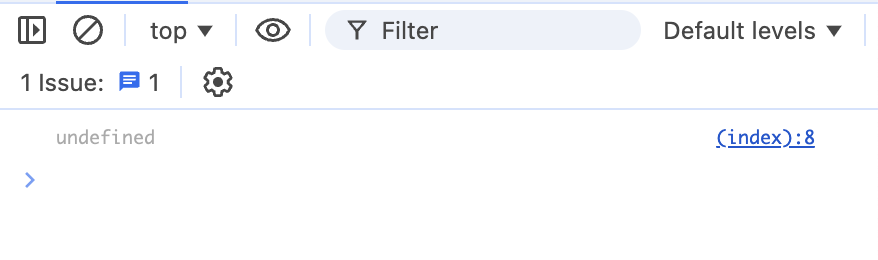
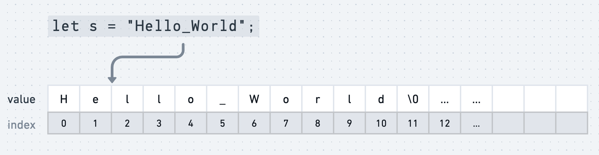
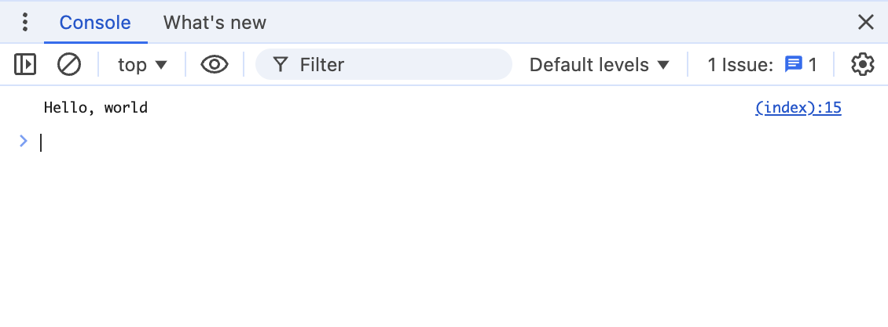
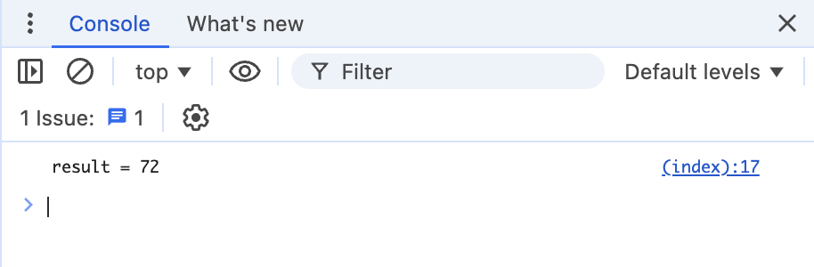
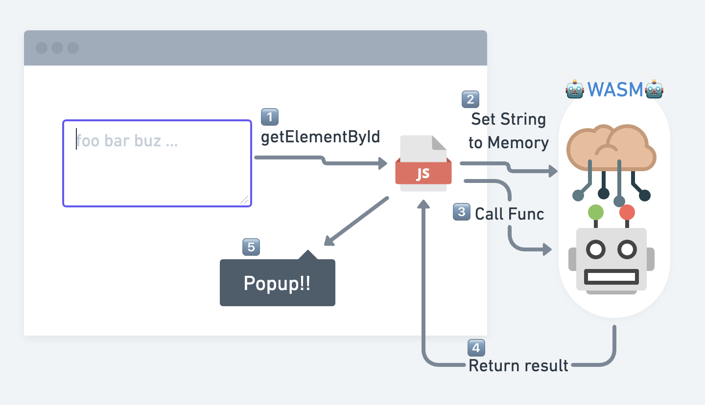
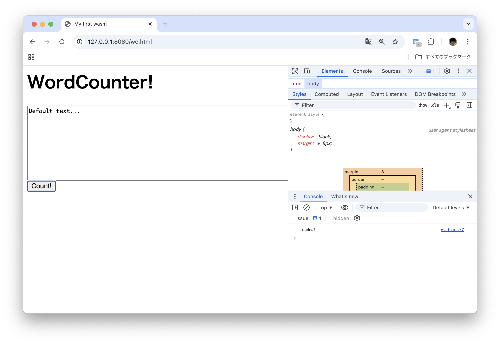
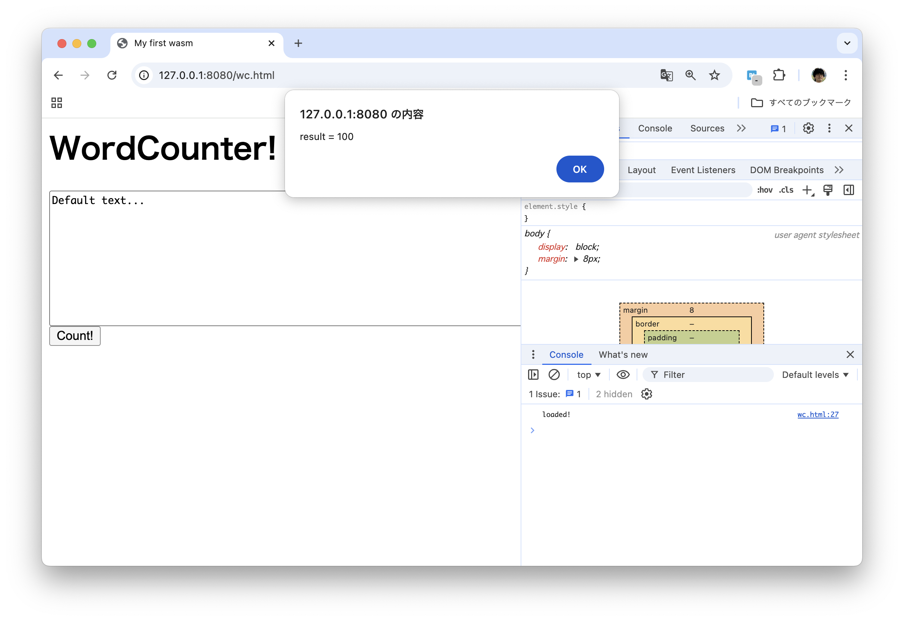
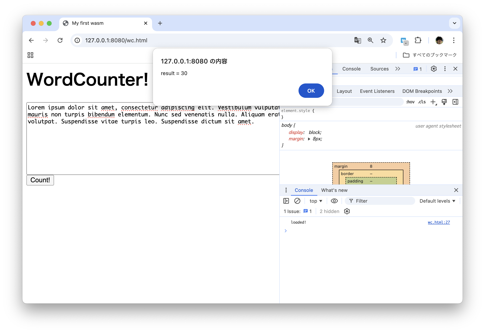
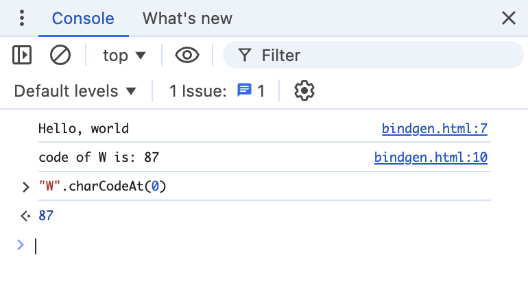

----
marp: true
title: "WebAssemblyでScratchプラグインを作ろう!"
description: "At Engineer Cafe Lab Fukuoka 2024/11"
header: "WebAssemblyでScratchプラグインを作ろう!"
footer: "#2 One More Step into WebAssembly"
theme: ecl
image: https://udzura.jp/engineer-cafe-lab-wasm-course/2024-25/02_string/ogp.png
paginate: true
----

<!--
_class: hero
-->

# WebAssemblyで<br>Scratchプラグインを作ろう!

## #2 One More Step into WebAssembly

----

# 今回から少し難しくなるよ

<!--
  全体に
  コマンドを実演しながらやる
  コード例もなるべく見せる
-->

----

# 今日やること

- WebAssemblyと文字列
  - 実験その1
- 線形メモリってなんだ
- 線形メモリを扱ってブラウザと文字列のやり取りをする
- 実践的なプログラムを作る

----

<!--
_class: hero
-->

# WASM・文字列・線形メモリ

----

# 文字列を扱ってみよう

- 「文字列」ってどんなもの？

```javascript
console.log("Hello, World");
console.log("こんにちは！");

// WASMなら、例えばこう？
let msg = wasm.exports.hello();
console.log(msg);
```

----

# そのままコードに書いてみよう

- 今日のプロジェクトcrate

```
$ cargo new --lib hello-string
$ cd hello-string && code Cargo.toml # 前回参照
$ code src/lib.rs
```

```rust
#[no_mangle]
pub fn hello() -> &'static str {
    "Hello, world"
}
```

```
$ cargo build --target wasm32-unknown-unknown
```

<!-- 前回のCargo.tomlを表示してあげる -->

<!-- &'static str の説明は口頭で頑張る、ややおまじない風にはなるが... // Stringの方が結局いいか？ -->

----

# 動かしてみるとどうなる？

```html
<html><head>
    <title>My first wasm</title>
    <script async type="text/javascript">
        const obj = {};
        WebAssembly.instantiateStreaming(fetch("./string1.wasm"), obj).then(
            (wasm) => {
                let msg = wasm.instance.exports.hello();
                console.log(msg);
            },
        );
    </script></head>
    <body><h1>Wasm working on browser</h1></body>
</html>
```

----

# 返事がない

- エラーではない＝関数はあるけど、値が返らない？

<br>



----

# WASMバイナリはどうなってる？

- `hello()` は引数がないはずなのに、 `(i32) -> nil` ？？

```
$ wasm-objdump -x web/string1.wasm
...
Type[1]:
 - type[0] (i32) -> nil
Function[1]:
 - func[0] sig=0 <hello>
Export[4]:
 - memory[0] -> "memory"
 - func[0] <hello> -> "hello"
```

----

# 何が何やら...

// TODO: 俺たちは雰囲気でWASMをやっているの画像

----

# 「線形メモリ」について理解する必要がある

----

# 線形メモリとは

- WASMインスタンスで自由に使えるメモリ領域
- cf. 普通のOSのプロセス
  - メモリはプロセスごとに割り当てられる
    - そのうちのヒープの範囲にmalloc()できる
  - 他のデータ（命令コードほか）も同じ領域、アドレス範囲で使い分ける
- WASMの線形メモリ
  - インスタンスごとに割り当てられる
  - 線形メモリはプログラムのデータ専用で取り扱える

----

# 線形メモリの上の文字列



- 文字列＝連続したバイトという考え方はWASMでも重要

----

# つまり、線形メモリの上の文字列は

- **メモリ上の開始位置と、その長さ**が分かれば文字列を特定できる
- 文字列特定のためのデータ
  - WASMレベルではどちらも `i32`, `i32` と扱われる
    - Rustレベルでは `ptr: *mut u8` と `len: usize`
    - ※ C言語的に表現すれば `u8 = char`

----

# 線形メモリ = WASM/ブラウザ共有の仕組み

- WASMの世界とブラウザで、線形メモリを通じてデータのやり取りをすることもできる
  - ブラウザから [`instance.exports.memory` でアクセス](https://developer.mozilla.org/ja/docs/WebAssembly/JavaScript_interface/Memory)
- 逆にいうと:
  - 関数の引数/戻り値か、線形メモリでしか相互のやり取りができない
  - sandboxingの一環でもある

----

# 改めて

- 概念的なところをざっくり確認したところで
- 「文字列」を扱う関数をWASMにしてみよう

----

# 文字列の理解その1

- WASMインスタンスからブラウザに戻す時の挙動
  - を理解しよう

----

# こういうコードを書く

```rust
#[no_mangle]
pub fn hello() -> &'static str {
    "Hello, world"
}
```

- `wasm32-unknown-unknown` でコンパイルする
  - `--release` でコンパイルして最適化
  - バイナリは `target/wasm32-unknown-unknown/release/hello_string.wasm` にある

<!-- バイナリが一致しないこともあるが、opt-level = "s" かは確認 -->

----

# こういうシグネチャになる

```yaml
Type[13]:
 - type[3] (i32) -> nil # hello() -> str がこうなる
Function[55]:
 - func[0] sig=3 <hello>
Export[5]:
 - func[0] <hello> -> "hello"
```

----

# 少しWASMバイトコードを追ってみよう

- 正確に読める必要は今回はなく、雰囲気を掴みます
- wasm-objdump -d でバイトコードを人間に読める表現にしてくれる
  - wasm-tools にも似た機能がある

```
$ wasm-objdump -d \
    target/wasm32-unknown-unknown/release/hello_string.wasm
...
```

----

# hello関数のバイトコード

```
000117 func[0] <hello>:
 000118: 20 00                      | local.get 0
 00011a: 41 0c                      | i32.const 12
 00011c: 36 02 04                   | i32.store 2 4
 00011f: 20 00                      | local.get 0
 000121: 41 80 80 c0 80 00          | i32.const 1048576
 000127: 36 02 00                   | i32.store 2 0
 00012a: 0b                         | end
```

----

```asm
;; 最初の引数 = バッファ（メモリ上のoffset）
local.get 0
;; 132の 12 をスタックに
i32.const 12
;; メモリの offset + 4 に値 12 を保存
i32.store 2 4

;; 以下、同様に 1048576 を offset + 0 に保存
;; 1048576 こそ "Hello, world" のある位置
local.get 0
i32.const 1048576
i32.store 2 0

;; 関数を抜ける
end
```

<!-- storeの第一引数 2 はalignmentだが多くの実装でまだ無視されている予感がする -->

----

# ブラウザで呼び出す

```javascript
const obj = {};
WebAssembly.instantiateStreaming(fetch("./string1.wasm"), obj).then(
    (wasm) => {
        // bufferを確保するためヒープの先頭位置を使う
        let offset = wasm.instance.exports.__heap_base;
        let length = 8; // 32bit+32bit
        // bufferは、ブラウザ側からmemoryを操作し、memory中に確保する！
        let memory = wasm.instance.exports.memory;
        let buffer = new Uint8Array(memory.buffer, offset, length);
        wasm.instance.exports.hello(offset);

        // consoleから参照できるようにグローバル変数に入れてしまう
        window.buffer = buffer;
        window.wasm = wasm;
    },
);
```

<!-- 
  動かない時
  fetch("./string1.wasm") のファイル名を確認する
  consoleのエラーを伝える（全部コピペすること/画面キャプチャでもOK
-->

----

# buffer はこうなっている

```
> buffer
//=> Uint8Array(8) [0, 0, 16, 0, 12, 0, 0, 0,]
```

- 上位32bit = リトルエンディアンで `0, 0, 16, 0` == `1048576`
- 下位32bit = リトルエンディアンで `12`

----

# これを解釈する

```javascript
let buffer2 = new Uint8Array(wasm.instance.exports.memory.buffer, 1048576, 12);
let msg = String.fromCharCode.apply(null, buffer2);
concole.log(msg);
//=> Hello, world
```

----

# つまり...

- Rust(rustc) では、 `&str` を返そうとすると、指定のバッファに `offset, size` を埋めて返す関数になる
  - rustc 1.80.1 での挙動で、将来変わる可能性もある
- `String` などを使ってみても同じようになる
- これは正直、低レイヤといわれても扱いづらい...

----

# 他のやり方もある

```rust
#[no_mangle]
pub unsafe fn hello2() -> *const u8 {
    // これであれば直接offsetを返してくれる。ただしsizeがわからない
    "Hello, world".as_ptr()
}

use core::slice::from_raw_parts_mut;
#[no_mangle]
pub unsafe fn hello3(buf: *mut u8, buflen: i32) {
    let src: &[u8] = "Hello, world".as_bytes();
    // prt + lenから slice を再生する
    let buf: &mut [u8] = from_raw_parts_mut(buf, buflen as usize);
    // 値を入れていく
    (*buf).copy_from_slice(src);
}
// offset, sizeをコントロールできる。あくまで学習なのでunsafe...
```

----

# 文字列の返し方、どうすべきか？

- あくまで @udzura のいち意見です
- 参考程度（ベターなやり方がありそう）

----

## 簡易フローチャート

- 文字列はあらかじめ指定したバッファに返却できる
  - 長さは決まっている
    - `hello(buf: *mut u8, buflen: i32)` のシグネチャでbufを更新
  - （決まっていないと事前にバッファを指定できないはず）

----

## 簡易フローチャート #2

- 文字列は関数内でallocateされる
  - 長さが決まっている
      - `hello() -> *const u8` 、ブラウザ側で一定の長さを取り出す
  - 長さが決まっていない
    - ゼロ終端される
      - `hello() -> *const u8` 、ブラウザ側でゼロが来るまで取り出す
    - ゼロ文字を含むバイナリである
      - `hello(buf: *mut u8, buflen: i32)` で `offset, size` を埋める
      - ブラウザ側でパースし直して取り出す

----

# 再び動作検証

- 今回は「文字列はあらかじめ指定したバッファに返却できる＋長さは決まっている」で進めてみる

```rust
use core::slice::from_raw_parts_mut;
#[no_mangle]
pub unsafe fn hello_by_buflen(buf: *mut u8, buflen: i32) {
    let src: &[u8] = "Hello, world".as_bytes();
    let buf: &mut [u8] = from_raw_parts_mut(buf, buflen as usize);
    buf.copy_from_slice(src);
}
```

- 同じように `wasm32-unknown-unknown` でコンパイルする

----

# ブラウザから呼び出す

```javascript
const obj = {};
WebAssembly.instantiateStreaming(fetch("./string1.wasm"), obj).then(
    (wasm) => {
        let offset = wasm.instance.exports.__heap_base;
        let length = 12; // 12 bytes 必要なため
        let memory = wasm.instance.exports.memory;
        let buffer = new Uint8Array(memory.buffer, offset, length);
        wasm.instance.exports.hello_by_buflen(offset, length);
        // 上記のbufferに値が入るのでそのまま使える
        let msg = String.fromCharCode.apply(null, buffer);
        console.log(msg);
    },
);
```

<!--
  ポイント: 今回はHello, World以外のところで文字列を何も動的にアロケートしていない
  WASMの中でメモリ確保をする可能性がある場合、WASMの内部でアロケータを経由して呼んだ領域を使わせるのがベター
  （でないと、メモリ管理できてない状態になるはず、それはたまたま動いても不安）
  TODO: 03をnaosu
-->

----

# 動作確認

<br>



----

# 文字列の理解その2

- ブラウザからWASMインスタンスに渡す時の挙動
  - こちらも理解しよう

----

# この場合のコード

```rust
// 文字列の1バイト目を数値として返す
#[no_mangle]
pub fn welcome(src: &str) -> i32 {
    src.as_bytes()[0] as i32
}
```

- シグネチャはこうなる。strが2つの引数になる

```
Type[14]:
 - type[2] (i32, i32) -> i32
Function[57]:
 - func[3] sig=2 <welcome>
```

<!--
  ポイント: これも文字列を何もアロケートしていない
-->

----

# また少しWASMバイトコードを追ってみよう

```
00012c func[1] <welcome>:
 00012d: 02 40                      | block
 00012f: 20 01                      |   local.get 1
 000131: 45                         |   i32.eqz
 000132: 0d 00                      |   br_if 0
 000134: 20 00                      |   local.get 0
 000136: 2d 00 00                   |   i32.load8_u 0 0
 000139: 0f                         |   return
 00013a: 0b                         | end
 00013b: 41 00                      | i32.const 0
 00013d: 41 00                      | i32.const 0
 00013f: 41 ac 80 c0 80 00          | i32.const 1048620
 000145: 10 ab 80 80 80 00          | call 43 <_ZN4core9panicking...>
 00014b: 00                         | unreachable
 00014c: 0b                         | end
```

----

# blockの中を確認する

```wat
// 2番目の引数=sizeを取得
local.get 1
// 0 だとout of indexなのでエラー、ブロック抜ける
i32.eqz
br_if 0
// 1番目の引数=offsetを取得
local.get 0
// そのoffsetにあるバイトをi32として戻り値にload
i32.load8_u 0 0
// ブロックを抜ける/そのまま関数も抜ける
return
```

----

# ブラウザで確認

```javascript
const obj = {};
WebAssembly.instantiateStreaming(fetch("./string1.wasm"), obj).then(
    (wasm) => {
        let msg = "Hello from JavaScript";
        let offset = wasm.instance.exports.__heap_base;
        let memory = wasm.instance.exports.memory;
        let buffer = new Uint8Array(memory.buffer, offset, msg.length);
        // ブラウザ側で、メモリを確保し、値を埋める
        for( var i = 0; i < msg.length; i++ ) {
            buffer[i] = msg.charCodeAt(i);
        }
        let result = wasm.instance.exports.welcome(offset, msg.length);
        let msg2 = "result = " + result.toString();
        console.log(msg2);
    },
);
```

----

# ブラウザで確認結果

- `"H".charCodeAt(0) == 72`

<br>



----

# つまりこう書いても大体同じ

```rust
use core::slice::from_raw_parts;
#[no_mangle]
pub unsafe fn welcome2(src: *const u8, srclen: i32) -> i32 {
    let src: &[u8] = from_raw_parts(src, srclen as usize);
    src[0] as i32
}
```

- 本講義では、文字列を戻すときに合わせてこちらを使う

<!--
  ポイント: from_raw_partsを使っているので新たに何もアロケートしていない
-->

----

# ここまでのまとめ

----

## WASMインスタンス→ブラウザ、の場合

- ブラウザ側で、線形メモリ上に文字列を置くバッファを確保する
- そのバッファの位置を返却先としてWASMの関数に渡す
- WASMの関数はそのバッファに文字列を更新する
- 戻ってきたら同じ位置の線形メモリを通して文字列を取り出す

----

## ブラウザ→WASMインスタンス、の場合

- ブラウザ側で、線形メモリ上に文字列のバイト列をコピーする
- そのバッファの位置をWASMの関数に渡す
  - 必要なら長さも渡す
- WASMの関数はその情報から文字列を取り出して扱う

----

<!--
_class: hero
-->

# 文字列の扱い・応用編

----

# 以下を実装しよう

- WASMによるワードカウントモジュールを作る

----

# 設計しよう

- フォーム→テキストを取り出す
- テキストデータ→WASMに渡す
- WASM→文字列を復元する
- 数えた結果は数値なので、関数の戻り値でやり取りできる

----

# 図



----

# Rust側をまずは書いておく

- プロジェクトをもう一つ作る

```
$ cargo new --lib wordcount-wasm
# ... Cargo.tomlなどを編集
```

ダミーの値を返してみよう

```rust
#[no_mangle]
pub unsafe fn wordcount(src: *mut u8, srclen: i32) -> i32 {
    return 100;
}
```

----

# ブラウザ側実装

```html
<html>
  <head>
    <title>My first wasm</title>
    <script async type="text/javascript">
      // ...次のスライドへ
    </script>
  </head>
  <body>
    <h1>WordCounter!</h1>
    <textarea rows="10" cols="80"
      id="target">Default text...</textarea>
    <input type="button" onclick="fire();" value="Count!"/>
  </body>
</html>
```

----

## JavaScript:

```javascript
const obj = {};
window.wasmInstance = null;
window.wordcount = null;
window.fire = function() {
    if (wasmInstance === null) { return; }
    let input = document.getElementById("target").value;
    let offset = wasmInstance.exports.__heap_base;
    let memory = wasmInstance.exports.memory;
    let buffer = new Uint8Array(memory.buffer, offset, input.length);
    for( var i = 0; i < input.length; i++ ) {
        buffer[i] = input.charCodeAt(i);
    }
    let result = wordcount(offset, input.length);
    let msg = "result = " + result.toString();
    alert(msg);
}
WebAssembly.instantiateStreaming(fetch("./wc.wasm"), obj).then(
    (wasm) => {
        window.wasmInstance = wasm.instance;
        window.wordcount = wasm.instance.exports.wordcount;
        // 作業用の領域を拡張する
        wasmInstance.exports.memory.grow(1);
        console.log("loaded!");
    },
);
```

----

# 一度通しで動かす

- `wasm-wordcount` crateをwasm32-unknown-unknownでビルド
- できたwasmファイルをhtmlと同じディレクトリに `wc.wasm` として保存



----

# 一度通しで動かす

- ダミーの値がポップアップすればOK



----

# Rust側のワードカウンター

- あくまで一例 / 真面目なエラー処理は...宿題です

```rust
#[no_mangle]
pub unsafe fn wordcount(src: *mut u8, srclen: i32) -> i32 {
    let src: &[u8] = from_raw_parts(src, srclen as usize);
    if srclen == 0 {
        return 0; // empty
    }
    let mut count = 1;
    for c in src.iter() {
        let c = *c;
        if c == 0x20 { // space
            count += 1;
        }
    }
    count
}
```

<!--
  ポイント: from_raw_partsを使っているので新たに何もアロケートしていない
  そのため、WASM外部で確保したメモリを使わせても問題が起きない
-->

----

# 動作確認しよう

- もう一度wasm32-unknown-unknownでビルド、コピー



----

<!--
_class: hero
-->

# こんなにめんどくさいの？

* と思ったあなたへの答え

----

# 実際のWASMの現場では

- wasm-bindgenがラップしてくれます
- 詳細なドキュメントは[公式](https://rustwasm.github.io/docs/wasm-bindgen/introduction.html)に譲りますが、今回は簡単に試す

----

# wasm-bindgen を導入する

- `wasm-pack` が必須になるのでインストール
- `wasm-bindgen` を依存に追加

```
$ cargo install wasm-pack
$ cargo add wasm-bindgen
```

----

# wasm-bindgen 対応関数

- `#[wasm_bindgen]` attributeが使える

```rust
// &str は戻り値には使えない
#[wasm_bindgen]
pub fn hello_bg() -> String {
    "Hello, world".to_string()
}

#[wasm_bindgen]
pub fn welcome_bg(src: &str) -> i32 {
    src.as_bytes()[0] as i32
}
```

----

# wasm-bindgen のコンパイル

```
$ wasm-pack build --target web
# ./pkg に一式が生成されるのでコピー
$ cp -r pkg/ web/pkg/
```

----

# ブラウザからの利用

```html
<script async type="module">
    import init, {hello_bg, welcome_bg} from './pkg/hello_string.js';
    await init();
    let result = hello_bg();
    console.log(result);

    let result2 = welcome_bg("Welcome world");
    console.log("code of W is: " + result2.toString());
</script>
```

----



----

# 今回、あえて低レイヤなやり方をしています

- 抽象度が低い実装に触れることのメリット:
  - 実際の仕事では抽象度の高いツールを使っても理解しやすくなる
  - トラブルシュートやデバッグの解像度が上がる
- このメリットを重視して、やや遠回しだけどなるべく抽象化しないやり方をしています
- 内部を理解しつつ現場で使う際は最適な方法を取りましょう

----

<!--
_class: hero
-->

# まとめ

----

# 今日のまとめ

## 以下のような内容を学んだはず

- WASMにおける「文字列」
- 線形メモリの基本
- テキストデータをやり取りする際の実装例
- 応用

----

<!--
_class: hero
-->

# 演習課題

----

# 演習課題

- **1)** `upcase()` という、ブラウザから来たASCIIの文字列を全て大文字にして返却する関数をWASMで実装しましょう。以下のようなシグネチャになるはずです。
  - Rustレベルでは:
    `upcase(srcp: *const u8, slen: i32, destp: *mut u8, dlen: i32)`
  - WASMレベルでは:
    `upcase(srcp: i32, slen: i32, destp: i32, dlen: i32) -> nil`
- **2)** 1) をブラウザで呼び出して動作確認しましょう。

<!--
  ポイント: 本講義のような、新たに何もアロケートしない方法を推奨する
  内部で String::from(&str) すると意図しない挙動になるかも...
  もしくはもう一つ関数をexportし、そこでslen長ののStringを作らせてもいいと思われる
-->


----

# 演習課題（上級編）

- **3)** wasm-bindgen が生成してくれるマクロコードを確認し、文字列についてどのようなラッパーコードが生成されるか確認してみよう...。
  - cargo-expand などを活用できるかもしれない
  - 手始めは[私と考えが近い人の記事](https://qiita.com/Nanai10a/items/ef508cd6addaa33b3e00)とか。
- めちゃ大変なので、いつかという気持ちでやってみましょう

----

# 次回

- #3 WebAssembly モジュールでより複雑なことをしよう
  - <span style='font-size: 30pt'>予定: 12/16(月) 19:00 start</span>
  - キーワード:
    - 画像処理
    - グレースケール化
  - 次回は平日夜間開催なのでご注意ください！
- TBA: 2025年の予定
