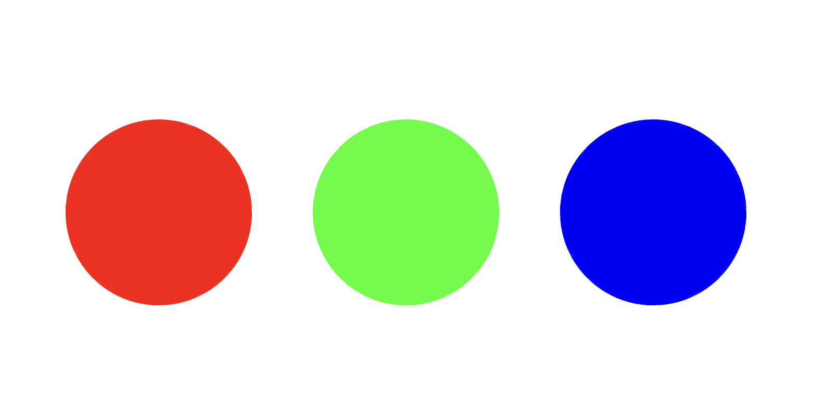
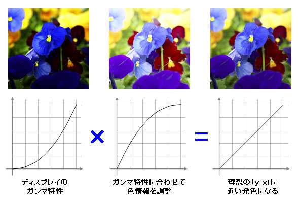
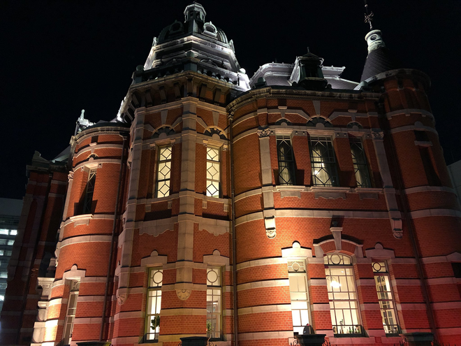
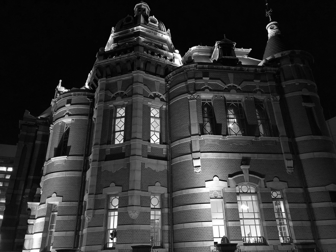
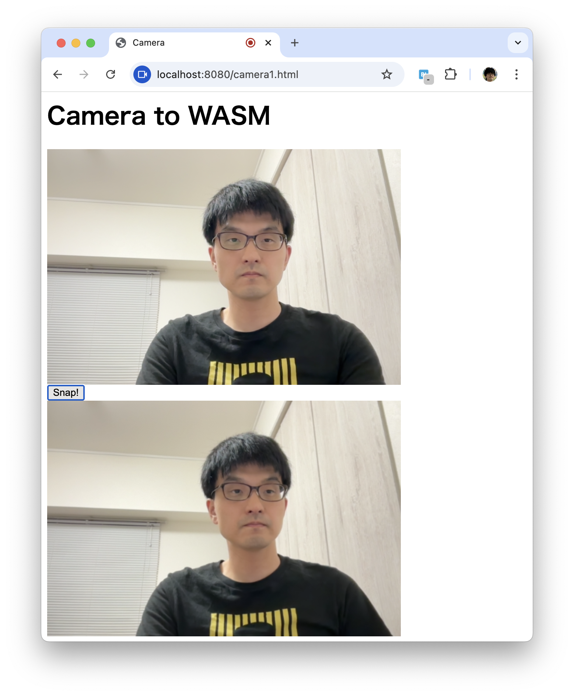
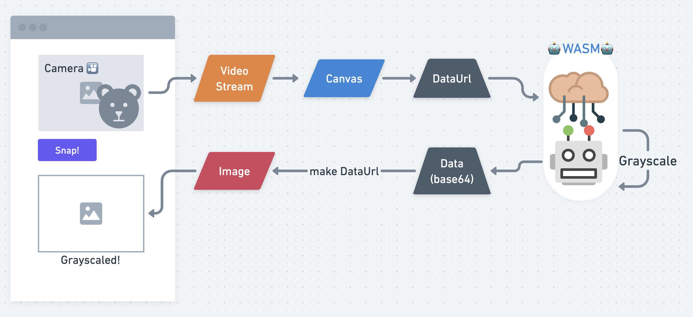
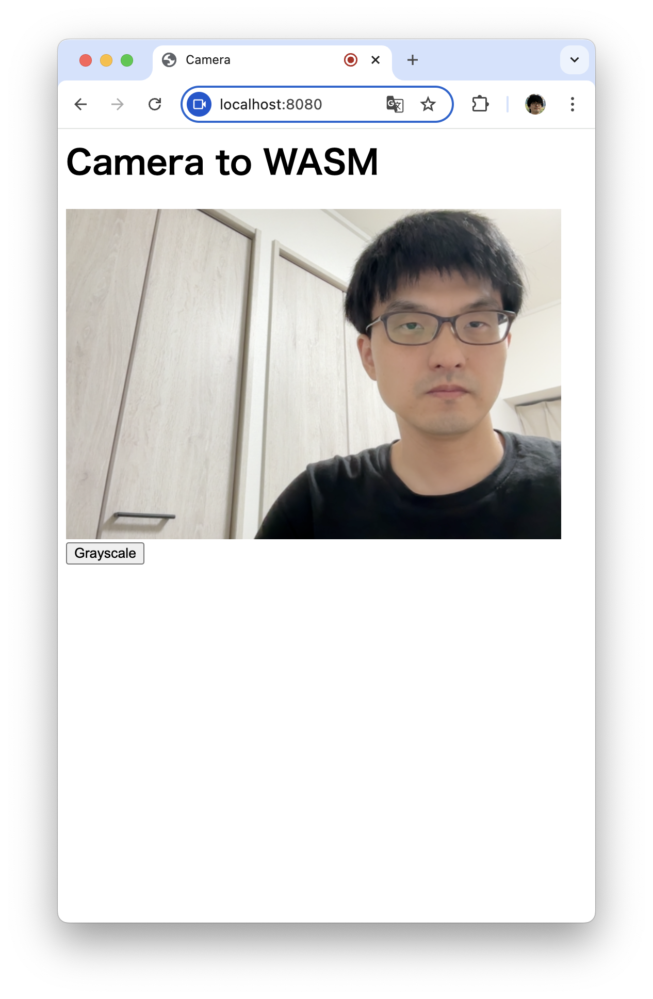
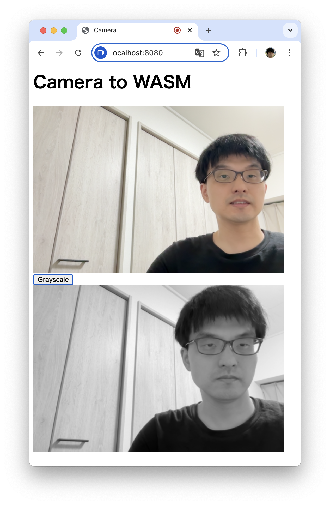

----
marp: true
title: "WebAssemblyでScratchプラグインを作ろう!"
description: "At Engineer Cafe Lab Fukuoka 2024/12"
header: "WebAssemblyでScratchプラグインを作ろう!"
footer: "#3 WebAssembly for Our Application"
theme: ecl
image: https://udzura.jp/engineer-cafe-lab-wasm-course/2024-25/03_wasmadvanced/ogp.png
paginate: true
----

<!--
_class: hero
-->

# WebAssemblyで<br>Scratchプラグインを作ろう!

## #3 WebAssembly for Our Application

----

# 前回、難しかったですね〜

----

# もっと複雑になります

- わかる範囲でも手を動かそう
- 一歩一歩やっていく
- 年末年始にも勉強できますね...

<small>今回の方が成果物があるのでわかりやすいかもしれない</small>

----

<!--
_class: hero
-->

# 画像処理をしよう

----

# 今日の学習の流れ

- Rustで画像処理の基本的なコードを書く
  - グレースケール化の概要
- また、ブラウザでカメラめいたものを実装する
- そして... それらのデータを繋ぎこむ！
  - グレースケール化をWASMにする
  - 画像データをやり取りする

----

# やることが... 多い！

TBA: 当日だけ引用の範囲で画像を出す

- 頑張りましょう。年末だし
- 今日間に合わなくても、Discordや別日での質問を活用しよう

----

# Rustで画像処理をする

----

# 画像のグレースケール化

- これをRustで実装します

----

# 画像の「明るさ」の基本概念

- 色によって感じ方が違う
- 人間の明るさの感じ方は線形でない



----

# ガンマ補正とは？

- 人間の明るさの感じ方は線形でない
- なので、例えばディスプレイでは強さによって自然に見えるよう補正をかけている
- これがガンマ補正
  - 画像は[EIZOライブラリー](https://www.eizo.co.jp/eizolibrary/other/itmedia02_07/)より引用



----

# なのでグレースケールにするときも...

- 「色によって感じ方が違う」3色をまとめるのでガンマ補正を考慮する
  - モニタでは3色それぞれに曲線がある
- 様々な計算式がある
  - ITU-R Rec BT.601 `V = 0.299*R + 0.587*G + 0.114*B`
  - ITU-R Rec BT.709 `V = 0.2126*R + 0.7152*G + 0.0722*B`
  - ...

----

# 実際やってみよう

- 「平均値」で画像をグレースケールにする

### 色覚特性のある方への補足

- 本資料の[サンプルコード](https://github.com/udzura/engineer-cafe-lab-wasm-course/tree/master/samples/fukuoka-ecl-imagetest)の中で、画像のピクセル化の実装例も提示しています。合わせてご参照ください

----

# Rustでの実装

- imageクレートを使う
  - なるべく低レイヤと言ったが...
  - 流石にPNGのフォーマットをパースして、までは時間がないため...
- このクレートはそのままWASMでも動く！

----

# 実装準備

- プロジェクトの作成

```
$ cargo new --lib fukuoka-ecl-imagetest
```

- `Cargo.toml` を次のスライドの通り編集

----

# 依存ライブラリのインストール

```toml
[package]
...

[dependencies]
base64 = "0.22.1"
image = { version = "0.25.2", default-features = false, features = ["png"] }

[lib]
crate-type = ["cdylib", "rlib"]

[profile.release]
opt-level = "s"
```

- 一度 `cargo build` してインストール

----

### グレースケール化実装コード

```rust
extern crate image;
use std::error::Error;
pub fn grayscale(path: &'static str, dest_path: &'static str)
    -> Result<(), Box<dyn Error>> {
    let img = image::ImageReader::open(path)?.decode()?;
    let img = img.to_rgb8();
    let size_x = img.width();
    let size_y = img.height();
    let mut dest = image::GrayImage::new(size_x, size_y);
    for y in 0..size_y {
        for x in 0..size_x {
            let pixel = img.get_pixel(x, y);
            let val = (pixel[0] as f32 + pixel[1] as f32 + pixel[2] as f32) / 3.0;
            let val = [val as u8; 1];
            dest.put_pixel(x, y, image::Luma(val));
        }
    }

    dest.save(dest_path)?;
    Ok(())
}
```

----

# examples以下に動作確認コード

- `examples/smoke.rs`

```rust
use std::error::Error;
use fukuoka_ecl_imagetest::*;

fn main() -> Result<(), Box<dyn Error>> {
    grayscale("./source.png", "./result.png")?;
    Ok(())
}
```

----

# 動作確認しよう

```
$ touch original.png # この名前でPNG形式の画像を作成

$ cargo run --example smoke
...
    Finished `dev` profile [unoptimized + debuginfo] target(s) in 0.01s
     Running `.../target/debug/examples/smoke`

$ ls -l *.png
original.png
result.png
```

----

<div>
<h2 style="float: left; margin-left: 1.2em;">Source</h2>
<h2 style="float: right; margin-right: 9.6em;">Result</h2>
</div>

<div>



</div>

<br>
※ 余裕があれば、平均値以外のグレースケールも試してみよう

----

# ブラウザで「カメラ」を実装する

----

# 「カメラ」を実装する作戦

- video要素を使うことができる
- video要素を映像のみにする
- video要素の映像フレームは、取り出してcanvas要素の中身にできる
  - `drawImage()` にvideo streamをそのまま渡せる
- そうなれば `toDataURL()` で取り出してimgを更新可能

----

# 実装コード(html)

```html
<html>
    <head>
        <title>Camera</title>
        <script async type="text/javascript">...</script>
    </head>
    <body>
        <h1>Camera to WASM</h1>
        <div>
            <video autoplay muted playsinline id="myvideo" width="480" height="320"></video>
        </div>
        <div>
            <button type="button" id="snap">Snap!</button>
        </div>
        <div>
            
        </div>
        <script async type="text/javascript">
            start();
        </script>
    </body>
</html>
```

----

# 実装コード(scriptタグ内部に書く)

```javascript
window.start = async function() {
    const video = document.getElementById("myvideo");
    const stream = await navigator.mediaDevices.getUserMedia({
        video: {
            facingMode: 'user',
            width: 480,
            height: 320,
        },
        audio: false,
    });
    video.srcObject = stream;

    const [track] = stream.getVideoTracks();
    const {width, height} = track.getSettings();

    const button = document.getElementById("snap");
// ...
```

----

## ...続き

```javascript
//...
    button.addEventListener("click", e => {
        const canvas = document.createElement('canvas');
        canvas.setAttribute('width', width);
        canvas.setAttribute('height', height);
        const context = canvas.getContext('2d');
        context.drawImage(video, 0, 0, width, height);

        const dataUrl = canvas.toDataURL('image/png');
        const image = document.getElementById("destination");
        image.style.display = "inline";
        image.src = dataUrl;
    });
} // end window.start()
```

- コードの説明は口頭で

----

# 動作確認 #2

- このhtmlを `web` ディレクトリに保存し、ローカルにサーバを起動して確認



----

# 必要なものはできてきた！

- 画像変換をするプログラム
- ブラウザで画像を撮影し、データを取り出すJavaScript

----

### これらをつなぎ合わせる



----

# RustのプログラムをWASM化する

----

# WASMに合わせて設計方針を変える

- データをdataURL形式で取得したい
  - `data:image/png;base64,iVBORw0KGgoAAAANSUhEUgAAAeAA...` など
  - 完全なバイナリは取り扱いづらいので...
- 返却もbase64にエンコードしたい
  - そのままdataURL形式に流用
- base64の文字列なので **ゼロ終端** できる

<!--
  画像をブロブオブジェクトに変換しそれ経由でバイナリ<->ArrayBufferのように
  相互変換したりもできるが、操作がやや特殊なので宿題とします
-->

----

# WASMに合わせてシグネチャを決定する

```rust
pub unsafe fn grayscale(
  width: u32,
  height: u32,
  src: *const u8, // メモリにセットしたdataURLのoffset
  slen: i32,      // メモリにセットしたdataURLの長さ
) -> *const u8;   // 作った結果はoffsetだけ返却する
```

----

### この方針で実装しよう (1/3)

```rust
use core::str;
use core::slice::from_raw_parts;
use base64::{engine::general_purpose, Engine};
#[no_mangle]
pub unsafe fn grayscale(
    width: u32, height: u32, src: *const u8, slen: i32,
) -> *const u8 {
    // 最初に返却用のバッファを、大きく確保する
    let mut result_buf: Vec<u8> = Vec::<u8>::new();
    result_buf.resize(1<<22, 0);

    // URLをstrに変換し、base64だけ取り出す
    let src = from_raw_parts(src, slen as usize);
    let url = str::from_utf8(src).unwrap();
    let collected = url.split(",").collect::<Vec<&str>>();
    let src = collected[1].as_bytes();
    // decode base64
    let blob: Vec<u8> = general_purpose::STANDARD.decode(src).unwrap();
    //...
```

----

### この方針で実装しよう (2/3)

```rust
    // ...
    // 渡されたデータをPNGとして解釈する
    let img = image::load_from_memory_with_format(
        &blob, image::ImageFormat::Png).unwrap();
    let img: image::ImageBuffer<image::Rgb<u8>, _> = img.to_rgb8();

    // あとは元のgrayscaleと同様のコード
    let mut dest = image::GrayImage::new(width, height);
    for y in 0..height {
        for x in 0..width {
            let pixel: &image::Rgb<u8> = img.get_pixel(x, y);
            let val = 
                (pixel[0] as f32 + pixel[1] as f32 + pixel[2] as f32) / 3.0;
            let val = [val as u8; 1];
            dest.put_pixel(x, y, image::Luma(val));
        }
    }
    // ...
```

----

### この方針で実装しよう (3/3)

```rust
    // ...
    // デバッグのため、wasmでないときにファイルを生成する
    #[cfg(not(target_arch="wasm32"))]
    {
        dest.save("/tmp/debug.png").unwrap();
    }

    // オンメモリで変換後のPNGを生成する
    let mut inter_buf = Vec::<u8>::new();
    let enc = image::codecs::png::PngEncoder::new(&mut inter_buf);
    dest.write_with_encoder(enc).unwrap_or_else(|_| panic!("encode failed") );

    // オンメモリのデータをbase64にエンコードする
    general_purpose::STANDARD.encode_slice(&inter_buf, &mut result_buf).unwrap();
    // データの先頭ポインタ = offset を返却
    result_buf.as_ptr()
}
```

----

### 最初は一応PCで確認する

- 上記をシンプルに実行する `examples/fromblob.rs` を作成

```rust
use std::error::Error;
use std::ffi::CStr;
use base64::{engine::general_purpose, Engine};
use fukuoka_ecl_imagetest::*;

fn main() -> Result<(), Box<dyn Error>> {
    // 画像をexamplesディレクトリにコピーして用意
    let src = include_bytes!("./source.png");
    let enc = general_purpose::STANDARD.encode(src);
    let enc = format!("data:image/png;base64,{}", enc);
    unsafe { // width, height は画像に合わせる
        let d = grayscale(660, 495, enc.as_ptr(), enc.len() as i32);
        let b64 = CStr::from_ptr(d as *const i8).to_str().unwrap();
        println!("data:image/png;base64,{}", b64)
    }
    Ok(())
}
```

----

# 最初は一応PCで確認する

- コンパイルエラー、ロジックエラーなどを見つける

```
$ cargo run --example blob | pbcopy
    Finished `dev` profile [unoptimized + debuginfo] target(s) in 0.01s
     Running `.../target/debug/examples/blob`

$ open /tmp/debug.png
# 生成されたPNGが壊れていないか、グレースケールになっているか
```

- （Macの場合） `pbcopy` でdata URLがクリップボードに格納されているので、ブラウザでそのURLを開いてみて確認できる。

----

# WASMにコンパイルする

```bash
# リリースビルドにしておこう
$ cargo build --target wasm32-unknown-unknown --release
```

- imageのfeatureをpngに絞っているので、最低限の依存でコンパイルできた

----

### JavaScript側の繋ぎを実装しよう

- 前回までの講義を思い出し、WASMをロードするコードを書く

```javascript
// const {width, height} = settings; の下に追記
// グローバルにwasmインスタンスを置く
window.wasm = null;
window.grayscale = null;

const obj = {
    env: {},
};
WebAssembly.instantiateStreaming(fetch("./grayscale.wasm"), obj).then(
    (wasm) => {
        window.wasm = wasm.instance;
        window.grayscale = wasm.instance.exports.grayscale;
        wasm.instance.exports.memory.grow(10); // メモリを明示的に確保しておく
        console.log("loaded!")
    },
);
```

----

### イベントリスナーも編集する

```javascript
document.getElementById("snap").addEventListener("click", e => {
    if (window.wasm === null) { return; }
    const canvas = document.createElement('canvas');
    canvas.setAttribute('width', width);
    canvas.setAttribute('height', height);
    const context = canvas.getContext('2d');
    context.drawImage(video, 0, 0, width, height);
    const dataUrl = canvas.toDataURL("image/png");
    // dataUrl をメモリにセット
    let offset = wasm.exports.__heap_base;
    let memory = wasm.exports.memory;
    let buffer = new Uint8Array(memory.buffer, offset, dataUrl.length);
    for( var i = 0; i < dataUrl.length; i++ ) {
        buffer[i] = dataUrl.charCodeAt(i);
    }
    // WASM関数の呼び出し
    const resOffset = grayscaleBlob(width, height, offset, dataUrl.length);
    // 結果の取り出し
    const resultBuf = new Uint8Array(memory.buffer, resOffset, 1 << 22);
    let resultBase64 = "";
    for ( var i = 0; resultBuf[i] != 0; i++) {
        resultBase64 += String.fromCharCode(resultBuf[i]);
    }
    // あとはimageのsrcに指定するだけ
    const image = document.getElementById("destination");
    image.style.display = "inline";
    image.src = "data:image/png;base64," + resultBase64;
});
```

----

# ファイル一式をまとめよう

- また `web` ディレクトリを掘っておく

```
$ mkdir web
$ code web/index.html
$ cp ./target/wasm32-unknown-unknown/release/fukuoka_ecl_imagetest.wasm \
      web/grayscale.wasm
$ cd web && python3 -m http.server 8080
```

----

# 通しで動作確認...

----

<div>



</div>

<!-- TODO: 時間があればエンジニアカフェで撮影した方が良くない？ -->

----

<!--
_class: hero
-->

# まとめ

----

# 今日のまとめ

## 今までの中間成果として...

- ブラウザで取得した画像をWASMに渡し、加工してブラウザに戻し表示する、という一連を実装しました
- ブラウザとWASMの実際的な連携を体験できました
- データを渡す際の留意点も体感できたかと思います

----

<!--
_class: hero
-->

# 演習課題

----

# 演習課題

- **1)** `pixelate()` という関数名で、ピクセレーション（モザイク化）を実装しましょう。
  - Rust/WASMでのシグネチャはgrayscaleと同じはずですね！
  - 例えば 10*10 の区間に区切って左上のピクセルの色で埋める、という感じの実装が考えられます
    - 少し調べたり工夫してみよう
    - 一応、サンプルコードが本講義のリポジトリにあります


----

# 演習課題

- **2)** グレースケール処理をJavaScriptでも実装してみましょう。
  - （ `1)` で実装したピクセレーション処理でも面白いでしょう）
  - そしてWASMと速度を比較しましょう
  - [ブラウザの Performance API](https://developer.mozilla.org/en-US/docs/Web/API/Performance/now) について調べてみましょう

----

# 演習課題

- **3)** 今日実装した内容を `wasm-bindgen` を使って再実装してみましょう。
  - コードは減るのですが、一方で色々と隠蔽されます
  - 便利さとカスタマイズやデバッグのバランスを感じましょう

----

# 次回

- #4 Scratch をハックする方法を学ぼう
  - <span style='font-size: 30pt'>予定: 2025/1/XX(YY) 14:00 start</span>
  - キーワード:
    - ScratchのMOD
    - React
    - TypeScript
- TBA: 2025年の予定...

----

# 参考資料

- リンクしたMDN以外のものを掲載
- web記事
  - [グレースケール画像のうんちく](https://qiita.com/yoya/items/96c36b069e74398796f3)
- 書籍
  - [改訂版 ディジタル画像処理の基礎と応用](https://www.cqpub.co.jp/hanbai/books/18/18341.htm)