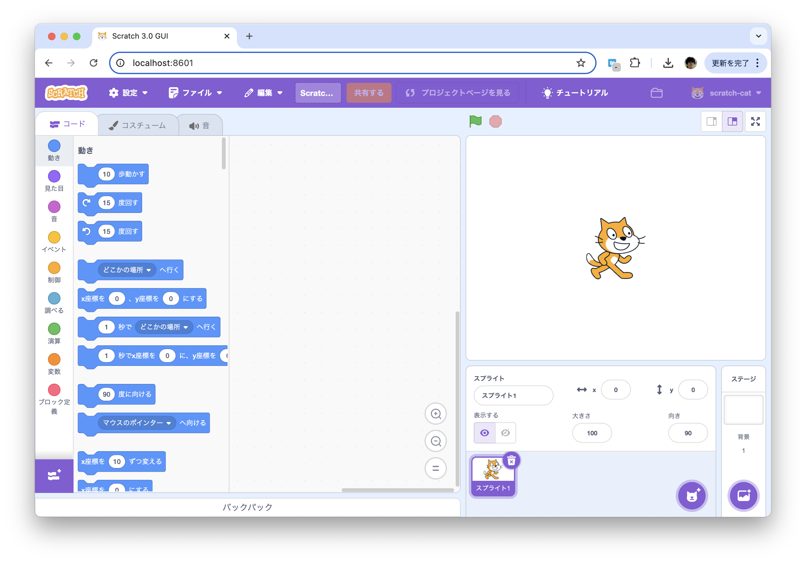
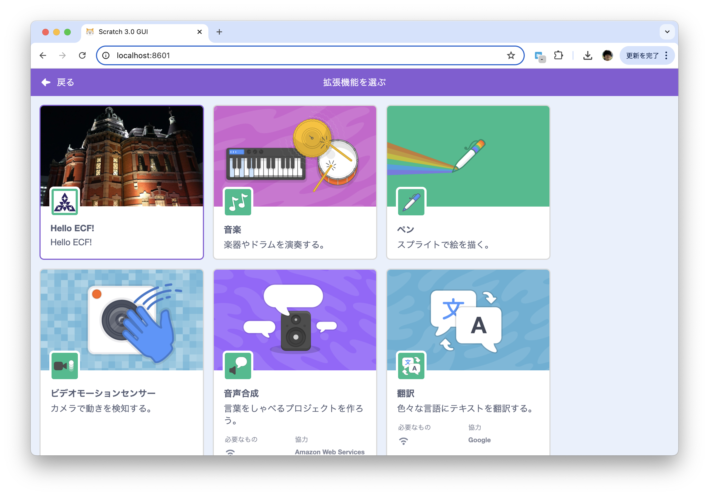
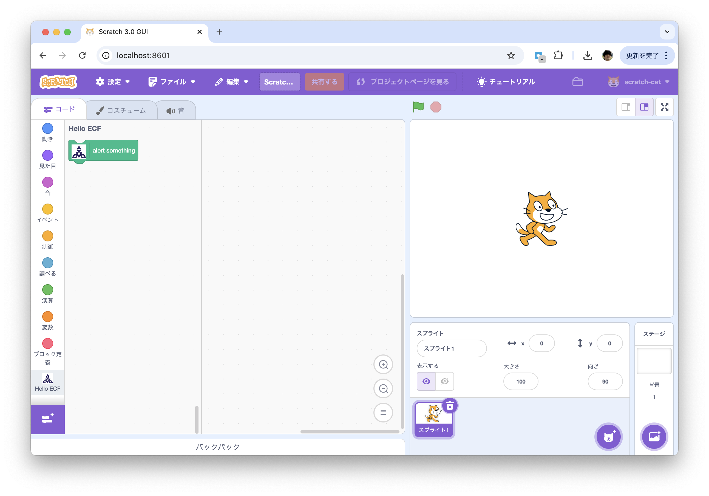
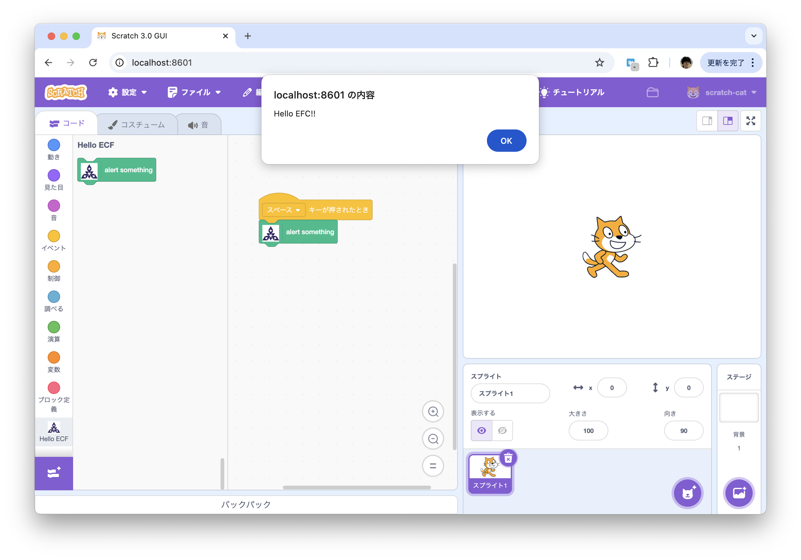
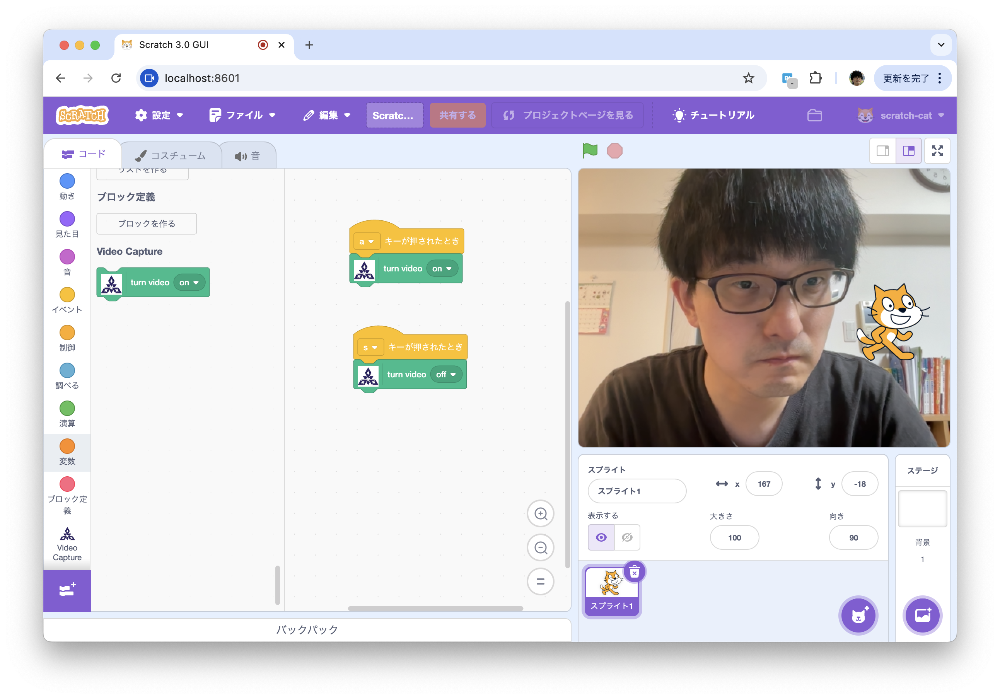
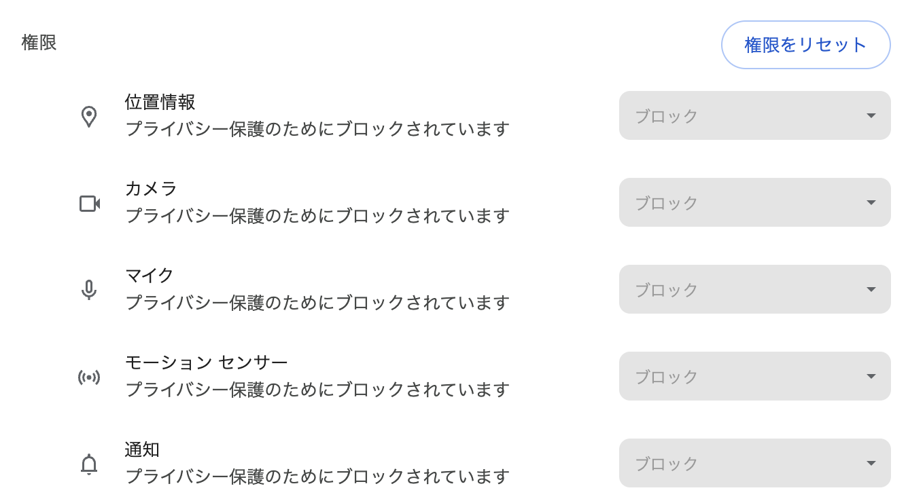

----
marp: true
title: "WebAssemblyでScratchプラグインを作ろう!"
description: "At Engineer Cafe Lab Fukuoka 2025/01"
header: "WebAssemblyでScratchプラグインを作ろう!"
footer: "#4 Scratch をハックする方法を学ぼう"
theme: ecl
image: https://udzura.jp/engineer-cafe-lab-wasm-course/2024-25/04_hackscratch/ogp.png
paginate: true
----

<!--
_class: hero
-->

# WebAssemblyで<br>Scratchプラグインを作ろう!

## #4 Learn How to Hack and Customize Scratch

----

# 今日は少しWASMから離れます

- JavaScript 祭りじゃ〜
- (ちなみに、ScratchのコードにTypeScriptはありませんでした...笑)

----

<!--
_class: hero
-->

# Scratch のカスタムブロックを追加する

----

# 環境構築

```
# Scratchのコア処理部分を切り出したもの
$ git clone --depth=1 https://github.com/scratchfoundation/scratch-vm.git

# ScratchのフロントエンドのReactの部分。npm startするのはこっち
$ git clone --depth=1 https://github.com/scratchfoundation/scratch-gui.git
```

- scratch-guiはすごくでかいです。
- この操作は事前実施推奨です（特にオンサイト参加の際は、回線に限界がありますので）

----

# まずはローカルに立ち上げる

- 参考ページ
  - https://ja.scratch-wiki.info/wiki/Scratch_3.0%E3%81%AE%E6%8B%A1%E5%BC%B5%E6%A9%9F%E8%83%BD%E3%82%92%E4%BD%9C%E3%81%A3%E3%81%A6%E3%81%BF%E3%82%88%E3%81%86/%E4%B8%8B%E6%BA%96%E5%82%99

----

## npm のインストール

- Macの場合
```
$ brew install npm
```

- Windowsの場合
  - WSLにnodejs、npmを入れる
```
$ sudo apt install -y nodejs npm
```
  - [nvm-windows](https://learn.microsoft.com/ja-jp/windows/dev-environment/javascript/nodejs-on-windows) でもいいかも？

----

## ライブラリのインストールとリンク

```
$ cd scratch-vm
$ npm install
$ npm link

$ cd ../scratch-gui
$ npm install
$ npm link scratch-vm
```

- `npm link` は、特定のnpmライブラリ（この場合はscratch-vm）について、ローカルのものを使わせるために必要です
- 今後、 `scratch-gui` と `scratch-vm` を頻繁に行き来するので確認しつつ！

----

## 起動する

```
# in scratch-gui dir
$ npm start
...
<i> [webpack-dev-server] Project is running at:
<i> [webpack-dev-server] Loopback: http://localhost:8601/, http://[::1]:8601/
<i> [webpack-dev-server] On Your Network (IPv4): http://192.168.64.1:8601/
<i> [webpack-dev-server] On Your Network (IPv6): http://[fd8b:...]:8601/
<i> [webpack-dev-server] Content not from webpack is served from '/Users/...' directory
...
```

- たくさんログが出るので流されているかも
- http://localhost:8601/ にアクセス！

----



----

# テストプラグインの追加

- 600x372と80x80の画像を用意する
- 右クリックで「画像を保存」したら原寸大で保存できます

| アイコン (600x372) | Insetアイコン (80x80) |
| -- | -- |
|  |  |

----

## extension ディレクトリを作成

```
# in scratch-gui project
$ mkdir -p src/lib/libraries/extensions/fukuoka
$ cp icon.png inset-icon.png src/lib/libraries/extensions/fukuoka
```

----

## extension 管理ファイルを編集

- `src/lib/libraries/extensions/index.jsx` を編集

```jsx
//...
import fukuokaIconURL from './fukuoka/icon.png'
import fukuokaInsetIconURL from './fukuoka/inset-icon.png'
// ...
```

----

### extension 管理ファイルを編集(続き)

```jsx
export default [ // この行の直後に追加
    {
        name: (
            <FormattedMessage
                defaultMessage="Hello ECF!"
                description="Engineer Cafe Fukuoka Sample Plugin"
                id="gui.extension.fukuoka.name"
            />
        ),
        extensionId: 'fukuoka',
        iconURL: fukuokaIconURL,
        insetIconURL: fukuokaInsetIconURL,
        description: (
            <FormattedMessage
                defaultMessage="Hello ECF!"
                description="Engineer Cafe Fukuoka Sample Plugin; This is test!"
                id="gui.extension.fukuoka.description"
            />
        ),
        featured: true
    },
//...
```

----

## この状態でブラウザを確認

- コードはホットリロードされる
のでブラウザリロードだけでOK
- プラグイン一覧を見ると...!!!



----

# プラグインの中身を作る

- 次は `scratch-vm` プロジェクトに移動する（VSCodeで開くなら開く）
  - `src/extensions/scratch3_fukuoka` を作成
  - `src/extensions/scratch3_fukuoka/icon.png` をコピー
  - `src/extensions/scratch3_fukuoka/index.js` を作る
    - `jsx` ではない！

----

```javascript
const BlockType = require('../../extension-support/block-type');
const fukuokaIcon = require('./icon.png');

class Scratch3FukuokaBlocks {
    constructor (runtime) {
        this.runtime = runtime;
    }

    getInfo () {
        return {
            id: 'fukuoka',
            name: 'Hello ECF',
            menuIconURI: fukuokaIcon,
            blockIconURI: fukuokaIcon,
            blocks: [
                {
                    opcode: 'testAlert',
                    blockType: BlockType.COMMAND,
                    text: 'alert something',
                    arguments: {},
                },
            ],
            menus: {},
        };        
    }
    testAlert() {
        alert("Hello ECF!!");
    }
}
module.exports = Scratch3FukuokaBlocks;
```

----

## FYI: CommonJSとES Module

```javascript
// CommonJSスタイル
module.exports = Scratch3FukuokaBlocks;
```

```javascript
// ES Moduleスタイル
export const Scratch3FukuokaBlocks = { ... }
```

- Scratchのコードベースは2つが混ざっている...（警告も出てる）
  - vmはCommonJS、guiはES Module
- 後者が今後の主流になるが、混ざってるのは仕方ないので...

----

## FYI: BlockTypeの話

| 定数 | 呼称 | 使い方 | 
| ---- | ---- | ---- | 
| `BlockType.BOOLEAN` | 真偽ブロック | true/falseを返す |
| `BlockType.COMMAND` | スタックブロック | 値を返さず関数実行 |
| `BlockType.HAT` | ハットブロック | 何かのイベントの起点 |
| `BlockType.LOOP` | C型ブロック | 繰り返しなど |
| `BlockType.REPORTER` | 値ブロック | 真偽値以外の何かの値を返す |

- Scratchの基本ブロックのどれに対応？を意識すれば理解しやすい

----

## 戻ってプラグインとしてロード

- `src/extension-support/extension-manager.js` を編集

```javascript
//...
const builtinExtensions = {
    // ...
    coreExample: () => require('../blocks/scratch3_core_example'),
    // These are the non-core built-in extensions.....

    // 最後に追加
    fukuoka: () => require('../extensions/scratch3_fukuoka'),
};
//...
```

----

# 動作確認

- `scratch-gui` に戻って `npm start` コマンドを再起動
- 「拡張機能を選ぶ」からHello ECF!を選択すると...



----

## 他のブロックとも組み合わせ可能

- 普通のScratchをしてるみたい！



----

<!--
_class: hero
-->

# もう少し踏み込んでみよう

----

# ビデオを制御してみよう

- 「ビデオモーションセンサー」のコードを参考にできる
- まず、単純にオンオフするには？

----

## ブロックの定義を編集する

```javascript
class Scratch3FukuokaBlocks {
    constructor(runtime) {
        this.runtime = runtime;
    }

    _VIDEO_STATE_ITEMS() {
        return [
            {text: 'off', value: 'off'},
            {value: 'on', value: 'on'},
        ];
    }
```

----

### 続き

```javascript
    getInfo() {
        return {
            id: 'fukuoka',
            name: 'Video Capture',
            menuIconURI: fukuokaIcon,
            blockIconURI: fukuokaIcon,
            blocks: [
                {
                    opcode: 'videoToggle',
                    blockType: BlockType.COMMAND,
                    text: 'turn video [VIDEO_STATE]',
                    arguments: {
                        VIDEO_STATE: {
                            type: ArgumentType.STRING,
                            menu: 'VIDEO_STATE',
                            defaultValue: 'on',
                        }
                    }
                }
            ],
            menus: {
                VIDEO_STATE: {
                    acceptReporters: true,
                    items: this._VIDEO_STATE_ITEMS(),
                }
            },
        };        
    }
```

----

### 続き

```javascript
    videoToggle(args) {
        const state = args.VIDEO_STATE;
        if (state === 'off') {
            this.runtime.ioDevices.video.disableVideo();
        } else {
            this.runtime.ioDevices.video.enableVideo();
            this.runtime.ioDevices.video.mirror = true;
        }
    }
}
```

----

## 再読み込み

- ビデオon/offが動いている



----

## ビデオに映った画像にアクセスするには？

- `getFrame()` と言う関数を定義しよう

```javascript
    getFrame() {
        const imageData = this.runtime.ioDevices.video.getFrame({
            format: './image-data',
        }); //...
    }
```

- ここの `imageData` は、 [ImageData](https://developer.mozilla.org/ja/docs/Web/API/ImageData) オブジェクトである

----

## ImageDataをcanvasの中に挿入する

- `putImageData()` の引数にできる
  - `drawImage()` はImageDataの場合使わない

```javascript
const canvas = document.createElement('canvas');
canvas.width = imageData.width;
canvas.height = imageData.height;
canvas.getContext('2d').putImageData(imageData, 0, 0);
```

----

## ビデオのフレームを画像としてポップアップ

- 一つの例

```javascript
    getFramePopup() {
        const imageData = this.runtime.ioDevices.video.getFrame({
            format: './image-data',
        });
        const canvas = document.createElement('canvas');
        canvas.width = imageData.width;
        canvas.height = imageData.height;
        canvas.getContext('2d').putImageData(imageData, 0, 0);

        let x = window.open("", "_blank",
            `width=${canvas.width},height=${canvas.height}`);
        x.document.open();
        x.document.appendChild(canvas);
    }
```

----

## scratchの背景に表示するには？

- `this.runtime.renderer` にアクセスできる
- スキン関係のメソッドを呼び出して背景をコントロールする

```javascript
const StageLayering = require('../../engine/stage-layering');

const skinId = this.runtime.renderer.createBitmapSkin(imageSource, 1);
const drawableId = this.runtime.renderer.createDrawable(
    StageLayering.BACKGROUND_LAYER
);
this.runtime.renderer.updateDrawableProperties(drawableId, {
    skinId: skinId,
});
```

----

### コードの例

```javascript
    getFrameAndSnapshot() {
        const imageData = this.runtime.ioDevices.video.getFrame({
            format: './image-data',
        });
        const canvas = document.createElement('canvas');
        canvas.width = imageData.width;
        canvas.height = imageData.height;
        canvas.getContext('2d').putImageData(imageData, 0, 0);
        // disableVideo() して一度消す必要がある
        this.runtime.ioDevices.video.disableVideo();
        const skinId = this.runtime.renderer.createBitmapSkin(canvas, 1);
        const drawableId = this.runtime.renderer.createDrawable(
            StageLayering.BACKGROUND_LAYER
        );
        this.runtime.renderer.updateDrawableProperties(drawableId, {
            skinId: skinId,
        });
    }
```

----

## 動作確認してみよう

// TBA: おじさんのキャプチャ

----

# カスタムScratchをWebで公開したい

- 補遺

----

# Webで公開用にビルドする

```
$ npm run build
```

- `build/` にstaticなファイル一式ができる
- static fileとして表示確認するには以下

```
$ python3 -m http.server 8080
## http://127.0.0.1:8080/build/ を開く
```

- あとはGitHub Pagesなどでそのまま公開すればOK
  - [GitHub Docs - GitHub Pages サイトを作成する](https://docs.github.com/ja/pages/getting-started-with-github-pages/creating-a-github-pages-site)

----

# 留意点

- 各種デバイスAPIを使用しているが、 http 通信のサイトではカメラ等はすべて使えない（Chrome の場合）
  - localhost の場合例外に利用できると言うだけ
- インターネット上にデプロイする場合は、 https が必須



----

<!--
_class: hero
-->

# まとめ

----

# 今日のまとめ

## 今日はScratchと関係するJavaScriptに向き合った日

- Scratchのオリジナルブロック(MOD)の開発環境構築
- ScratchのオリジナルブロックのHello World
- Scratchでビデオカメラを扱う方法
- Scratchの背景スキン画像を更新する方法
- Scratch MODをインターネットに公開する方法

----

<!--
_class: hero
-->

# 演習課題

- 今日は人によっては時間が余る？

----

# 演習課題

- **1)** 現状、ビデオ画面を撮影してスキンを更新後、「ビデオオフ」を実行しても何も起きません。
  - 背景がクリアされた方が挙動が自然なはず？
  - `disableVideo()` されたらどういう場合でもスキンがクリアされる挙動を実装してみましょう
    - ヒントになるコードは以下です

```javascript
// skinId を保存することができるはず？
this.captureSkinId = this.runtime.renderer.createBitmapSkin(canvas, 1);
// skinIdを元にスキンを削除する関数
this.runtime.renderer.destroySkin(this.captureSkinId);
```

----

# 演習課題

- **2)** `videoToggle()` に一つパラメータを追加しましょう（数値型）
  - そのパラメータの秒数後に画面が撮影される挙動を実装してみましょう
    - ヒント: [`setTimeout()` メソッド](https://developer.mozilla.org/ja/docs/Web/API/Window/setTimeout)
    - さらなるヒントになるコードは次のスライドにて

----

## 演習 2) のヒント

```javascript
// パラメータ入りのブロック
{
    opcode: 'snapshotDelayed',
    blockType: BlockType.COMMAND,
    text: 'snap video in [DELAY] second(s)',
    arguments: {
        DELAY: {
            type: ArgumentType.NUMBER,
            defaultValue: 0,
        }
    }
}, //...

// パラメータを取得するには？
snapshotDelayed(args) {
    const delay = args.DELAY;
    // delay は数値で取得できる
    //...
}
```

----

# 次回

- #5 Scratch とWebAssemblyを連携させよう
  - <span style='font-size: 30pt'>予定: 2025/2/27(木) 19:00 start</span>
  - キーワード:
    - 今までの総まとめ
    - (チャレンジ的内容) WebWorker

----

# 参考資料

- Scratchの拡張の開発はまとまった情報が少ないです！
  - 一旦日本語中心でリンクしておきます

----

# 参考資料

- web記事（公式/準公式）
  - [MDN](https://developer.mozilla.org/ja/docs/Web/JavaScript) の関連ページ（Video, ImageData）
  - [ビデオモーションセンサー拡張機能(ja公式Wiki)](https://ja.scratch-wiki.info/wiki/%E3%83%93%E3%83%87%E3%82%AA%E3%83%A2%E3%83%BC%E3%82%B7%E3%83%A7%E3%83%B3%E3%82%BB%E3%83%B3%E3%82%B5%E3%83%BC%E6%8B%A1%E5%BC%B5%E6%A9%9F%E8%83%BD)
  - [Scratch 3.0の拡張機能を作ってみよう(ja公式Wiki)](https://ja.scratch-wiki.info/wiki/Scratch_3.0%E3%81%AE%E6%8B%A1%E5%BC%B5%E6%A9%9F%E8%83%BD%E3%82%92%E4%BD%9C%E3%81%A3%E3%81%A6%E3%81%BF%E3%82%88%E3%81%86)
  - [GitHub Docs - GitHub Pages サイトを作成する](https://docs.github.com/ja/pages/getting-started-with-github-pages/creating-a-github-pages-site)
- 個人のブログ記事（ありがとうございます）
  - [Scratchを拡張しよう！(2)地図を表示](https://zenn.dev/naoji/articles/scratch-extension-0020)
  - [scratch-render.js で 何か作ってみよう](http://blogger.firefirestyle.net/2017/12/scratch-30-9-scratch-renderjs.html)

他...