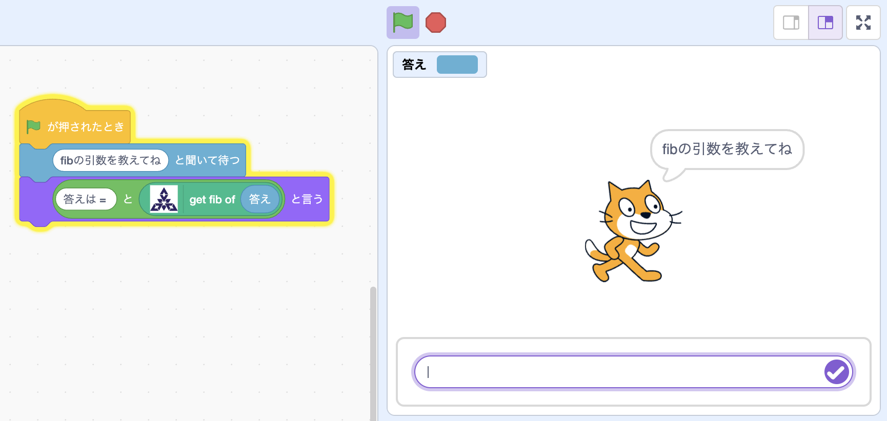
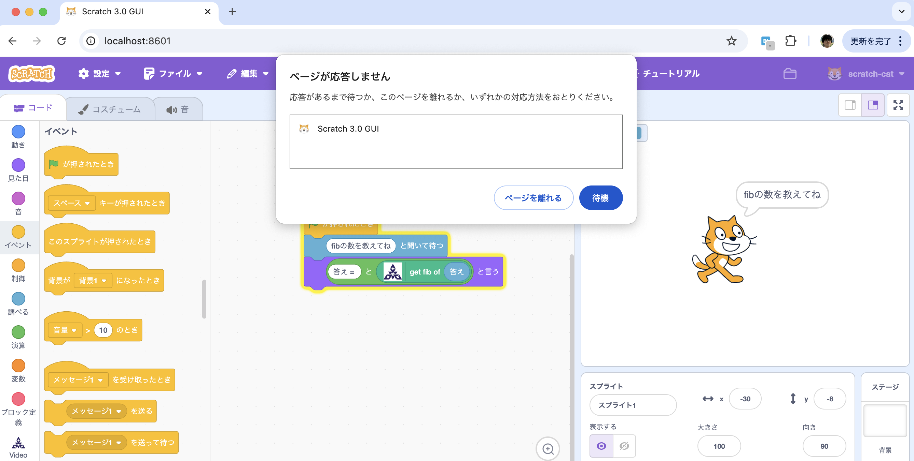
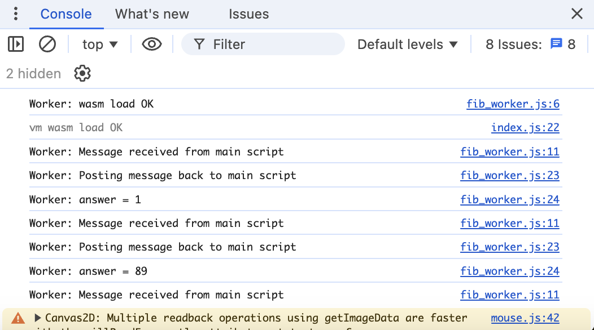
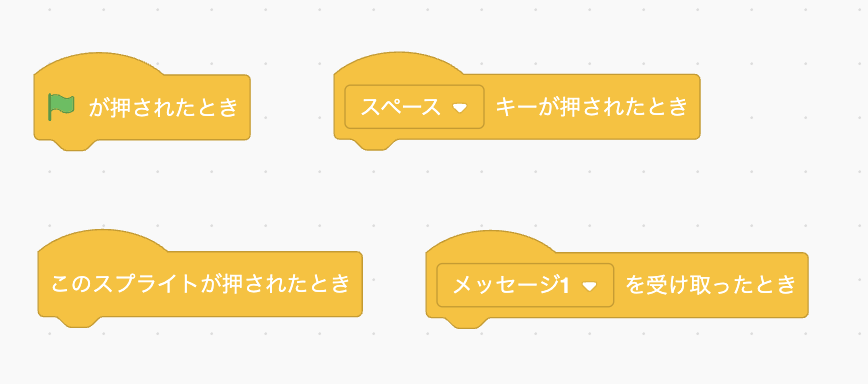
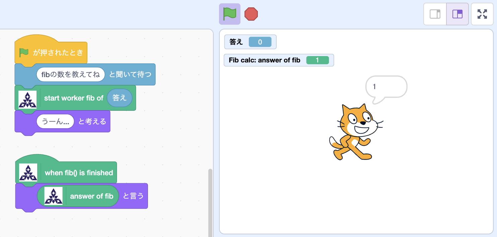
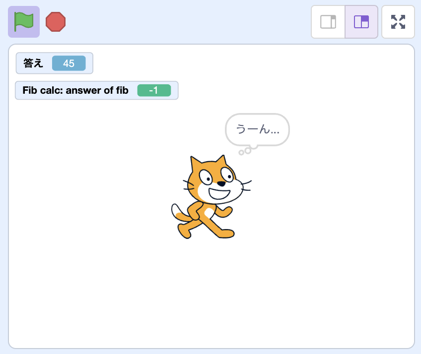
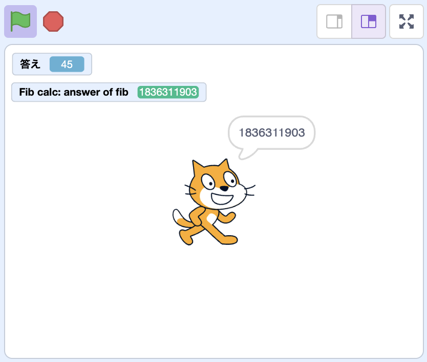

----
marp: true
title: "WebAssemblyでScratchプラグインを作ろう!"
description: "At Engineer Cafe Lab Fukuoka 2025/02"
header: "WebAssemblyでScratchプラグインを作ろう!"
footer: "#5 Scratch とWebAssemblyを連携させよう"
theme: ecl
image: https://udzura.jp/engineer-cafe-lab-wasm-course/2024-25/05_wasmandscratch/ogp.png
paginate: true
----

<!--
_class: hero
-->

# WebAssemblyで<br>Scratchプラグインを作ろう!

## #5 Let's Make WebAssembly and Scratch Work Together!

----

# いよいよ総まとめ！

----

# 前回の復習も兼ねて

- #4 の演習問題の解説を行います
  - （時間によりますが）

----

# 環境は前回のものをそのまま使用しましょう


----

# WASMバイナリをプロジェクトにコピー

- 第3回で作ったgrayscaleのWASMプログラムをそのまま使う
- scratch-guiプロジェクトの `static/wasm/grayscale.wasm` にコピーする

----

# プラグインの実装変更

- constructorから変更

```javascript
class Scratch3FukuokaBlocks {
    constructor(runtime) {
        this.runtime = runtime;

        this.captureSkinId = null;

        this.wasm = null;

        const obj = {}
        WebAssembly.instantiateStreaming(fetch("/static/wasm/grayscale.wasm"), obj).then(
            (wasm) => {
                this.wasm = wasm.instance;
                wasm.instance.exports.memory.grow(10);
                log.debug("wasm load OK")
            },
        );
    }
//...
```

----

## operation関数本体を実装

```javascript
    snapshotVideo() {
        const imageData = this.runtime.ioDevices.video.getFrame({
            format: 'image-data',
        });
        const canvas = document.createElement('canvas');
        canvas.width = imageData.width;
        canvas.height = imageData.height;
        canvas.getContext('2d').putImageData(imageData, 0, 0);

        if (!this.wasm) {
            return;
        }
```

----

```javascript
        const offset = this.wasm.exports.__heap_base;
        const memory = this.wasm.exports.memory;
        const dataUrl = canvas.toDataURL("image/png");
        let buffer = new Uint8Array(memory.buffer, offset, dataUrl.length);
        for( var i = 0; i < dataUrl.length; i++ ) {
            buffer[i] = dataUrl.charCodeAt(i);
        }
        const resOffset = this.wasm.exports.grayscale(
            canvas.width, canvas.height, offset, dataUrl.length);
        log.debug("wasm run OK")
```

----

```javascript
        let resultBuf = new Uint8Array(memory.buffer, resOffset, 1 << 22);
        let resultBase64 = "";
        for ( var i = 0; resultBuf[i] != 0; i++) {
            resultBase64 += String.fromCharCode(resultBuf[i]);
        }
        log.debug("debug image url:")
        console.log("data:image/png;base64," + resultBase64);
        // 一旦ここまで
    }
```

----

# ここまでで動作確認しよう

```javascript
    getInfo() {
        return {
            id: 'fukuoka',
            name: 'Video Capture',
            menuIconURI: fukuokaIcon,
            blockIconURI: fukuokaIcon,
            blocks: [ //...
                { // 最後に
                    opcode: 'snapshotVideo',
                    blockType: BlockType.COMMAND,
                    text: 'snapshot current video',
                    arguments: {}
                },
            ],
            menus: { ... },
        };
    }
```

----

## DataURL ができた

- デモ画面をご覧ください。

----

# dataURLをScratchのスキンに差し込む

- 画像データに変換するには、一旦 `Image` オブジェクトに差し込む

```javascript
const image = new Image()
image.src = "data:image/png;base64," + resultBase64;
```

- しかし、その直後 `drawImage()` を呼んでもうまくいかない

```javascript
const image = new Image()
image.src = "data:image/png;base64," + resultBase64;
canvas.getContext('2d').drawImage(image, 0, 0, canvas.width, canvas.height);
// => canvasが更新されない
```

----

## 実は画像のソース読み込みは非同期処理

- `image.src = ...` で更新した直後では描画がされていない
- どうするか？ `image.onload` を利用

----

```javascript
        // ....
        const image = new Image()
        image.onload = () => {
            canvas.getContext('2d').clearRect(0, 0, canvas.width, canvas.height);
            canvas.getContext('2d').drawImage(image, 0, 0, canvas.width, canvas.height);

            this.runtime.ioDevices.video.disableVideo();
            this.captureSkinId = this.runtime.renderer.createBitmapSkin(canvas, 1);
            const drawableId = this.runtime.renderer.createDrawable(
                StageLayering.BACKGROUND_LAYER
            );
            this.runtime.renderer.updateDrawableProperties(drawableId, {
                skinId: this.captureSkinId,
            });
        }
        image.src = "data:image/png;base64," + resultBase64;
    } // snapshotVideo end
```

----

# あとはこれを呼び出すようにすればOK

- 諸々更新しての動作確認:

----

# 全て完成！！

- Scratch のブロックからWebAssemblyの関数を呼び出し、画像加工をすることができました！

----

<!--
_class: hero
-->

# 〜 完 〜

----

- TODO: 男坂の画像

----

<!--
_class: hero
-->

# 最終演習課題...

----

# 力ある人のため最終演習課題...

- 第5回の内容は、今までの高難度を反映して分量を少なくしています
  - 余った時間でこれまでの内容の確認や復習をしましょう！
- ですが、ここまでの内容はすべて余裕を持ってこなしてきた方のために...
  - 最後の課題を出します

----

# fibで始まり、fibに帰る

- 第1回で作ったfibモジュールを `static/wasm` にコピーします

```
$ cp path/tp/hello_wasm.wasm static/wasm/fib.wasm
```

## このfibをscratchのブロックにしてみましょう

----

### 実装例

```javascript
    constructor(runtime) {
        this.runtime = runtime;
        this.fib = null;
        WebAssembly.instantiateStreaming(fetch("/static/wasm/fib.wasm"), {}).then(
            (wasm) => {
                this.fib = wasm.instance;
            },
        );
    }
    getInfo() {
        return {
            id: 'fiboka',
            name: 'Fib calc',
            menuIconURI: fukuokaIcon,
            blockIconURI: fukuokaIcon,
            blocks: [
                {
                    opcode: 'reportFib',
                    blockType: BlockType.REPORTER,
                    text: 'get fib of [N]',
                    arguments: {
                        N: {
                            type: ArgumentType.NUMBER,
                            defaultValue: 1,
                        }
                    }
                },
            ],
            menus: {},
        };
    }
    reportFib(args) {
        const n = args.N;
        const result = this.fib.exports.fib(n);
        log.debug(`answer: fib(${n}) = ${result}`);
        return result;
    }
```

----

# これは動く

- このReporterはこんな感じで使えばいい



----

# しかし？

- ある程度以上大きなfib(N)を求めようとすると...？



----

# ブラウザはシングルスレッド

- WASMは（なんとなく勘違いしがちだが）クライアントで動く
- したがって、WASMで重い処理をするとクライアントのCPUは使い果たされます

----

# じゃあどうするか？

----

# WebWorker

- 色々やり方はありそうだが今回、WebWorkerに挑戦しよう

----

# WebWorker とは

- ブラウザでの一部の処理をバックグラウンドで動かすための仕組み
- フロントのメインスレッドを使い切らない
  - したがって描画や制御の挙動に影響しないようになる

----

# WebWorker でWASMを動かす

- **`scratch-gui`** 側に `static/workers/fib_worker.js` を作成
  - WebWorker は別のJavaScriptファイルを読み込むため、今回はscratch-guiにstatic fileを作っている
  - もっといいやり方があるかも

----

### `fib_worker.js` の編集

```javascript
this.wasm = null;
obj = {};
WebAssembly.instantiateStreaming(fetch("/static/wasm/fib.wasm"), obj).then(
    (wasm) => {
        this.wasm = wasm.instance;
    },
);
onmessage = (e) => {
    console.log("Worker: Message received from main script");
    if (!this.wasm) {
        console.log("Worker: failed..."); return;
    }
    const n = e.data[0]
    if (isNaN(n)) {
        console.log("Worker: failed..."); return;
    } else {
        const result = this.wasm.exports.fib(n);
        console.log('Worker: Posting message back to main script');
        console.log(`Worker: answer = ${result}`);
    }
}
```

----

# Scratchからの呼び出し側の編集

```javascript
    constructor(runtime) {
        // Workerインスタンスを作り、fib_worker.jsをロードする
        this.worker = new Worker("/static/workers/fib_worker.js");
    }
    // ...
    reportFib(args) {
        const n = args.N;
        // Workerインスタンスにメッセージを送るよう変更
        this.worker.postMessage([n])
        return -1; // dummy
    }
```

----

# Fibは成功はしていそう



- 正しい数がコンソールに表示される
- 大きな数を与えても、メインスレッドがブロックしない
  - GUI操作が普通にできていることを確認できる

----

# ということで、重い処理でもUIがブロックしなくなった

- 無事問題が解決！

----

# ...あれ？

- 計算した値ってどうやって受け取るん？
- console開かないとわからないんじゃダメそう

----

# WebWorkerで値を受け取る

- worker処理側
  - `postMessage()` するとメインにあるworker側に返却できる
- メインスレッド側
  - workerインスタンスに `worker.onmessage` ハンドラがある
  - そこで受け取った値を処理する
  - イベント駆動っぽくできればかっこいい

----

# Scratchでイベント駆動をするには...

- `BlockType.HAT` を使う！
- 右の形状のブロックが `BlockType.HAT` タイプ
  - あーあれか...のやつ



----

## 下準備

- constructorにインスタンス変数を用意する

```javascript
    constructor(runtime) {
        this.runtime = runtime;
        this._workerRunning = false;
        this._workerMessage = null

        this.worker = new Worker("/static/workers/fib_worker.js");
    }
```

----

### ブロックの定義

```javascript
    blocks: [
        {
            opcode: 'startCalcFib',
            blockType: BlockType.COMMAND,
            text: 'start worker fib of [N]',
            arguments: {
                N: {
                    type: ArgumentType.NUMBER,
                    defaultValue: 1,
                }
            }
        },
        {
            opcode: 'whenFinishedFib',
            blockType: BlockType.HAT,
            text: 'when fib() is finished',
        },
        {
            opcode: 'reportFib',
            blockType: BlockType.REPORTER,
            text: 'answer of fib()',
        },
    ] //...
```

----

## opハンドラの定義

- まず、 COMMAND 型のブロックの中で `postMessage()` させる

```javascript
    startCalcFib(args) {
        const n = args.N;
        if (this._workerRunning) {
            return;
        }
        this._workerRunning = true;
        this._workerMessage = null;
        this.worker.postMessage([n]);
    }
```

----

## opハンドラの定義

- HAT型ブロックのハンドラは、 `true` を返した時にイベントが発火する
  - ブロックを利用したらポーリングで判定処理が実行され続ける
  - なので中身の処理は比較だけなど、軽いもの推奨


```javascript
    whenFinishedFib(args) {
        // コメントインするとたくさんログが流れる:
        // console.log("Fire whenFinishedFib");
        if (this._workerRunning && this._workerMessage !== null) {
            this._workerRunning = false
            return true;
        }
    }
```

----

## opハンドラの定義

- REPORTER 型ブロックでは `this._workerMessage` の値をそのまま返す
  - nullならダミーで -1 を返しておく

```javascript
    reportFib(args) {
        if (this._workerMessage === null) {
            return -1;
        } else {
            return this._workerMessage;
        }
    }
```

- これでハンドラ実装は以上

----

## constructorに戻って変更

- `onmessage` イベントを受け取って変数を更新するように変更

```javascript
    constructor(runtime) {
        this._workerRunning = false;
        this._workerMessage = null

        this.worker = new Worker("/static/workers/fib_worker.js");
        // ここを追加！
        this.worker.onmessage = (e) => {
            this._workerMessage = e.data[0]
        }
    }
```

----

## 最後にworker

- gui の `static/workers/fib_worker.js` を編集
- 最後に `postMessage` させる

```javascript
onmessage = (e) => {
    if (isNaN(n)) {
    // ...
    } else {
        const result = this.wasm.exports.fib(n);
        console.log('Worker: Posting message back to main script');
        console.log(`Worker: answer = ${result}`);
        postMessage([result]); // ここを追加
    }
}
```

----

## イベントの流れを図示してみた

- このようになるイメージ。...

```plaintext
startCalcFib -> postMessage -> [Worker側処理]
[Worker側処理] -> onmessage -> _workerMessage = data
whenFinishedFib -> _workerMessage !== null -> reportFib
```

----

# 最後の動作確認！

----

## 簡単な計算



----

## 重い処理は...





----

# より複雑なブロックも作れるようになった！

- COMMAND型の結果をREPORTER型で取得する
- HAT型でイベント駆動をする

----

<!--
_class: hero
-->

# まとめ

----

# 今日のまとめ

## WebAssemblyと、Scratchと、友達になれたかな？

- ScratchからWASMを呼ぶ方法
  - 2パターン
- WebWorkerについて
- `BlockType.HAT` によるScratchのイベント駆動化

----

# 最後のはずなのに... 追加の演習課題

- **1)** WebWorkerのエラーを、メインスレッドで受け取れるようにするにはどうすればいいでしょうか？
- **2)** WebWorkerのエラーをScratchのブロック側で制御できるようにしたいです。
  - 今のままでは、失敗しても、 **Scratch のプログラマから**エラーが見えません
  - どう言う設計をして、どう言うブロックを用意するといいでしょうか？

// WASM でなくなってる、と言うツッコミは置いといて...

----

<!--
_class: hero
-->

# 本当におしまい

- 最後までありがとうございました

----

# 参考資料

- MDN: WebWorker
  - https://developer.mozilla.org/ja/docs/Web/API/Web_Workers_API
- WebWorker 周りの良い記事
  - [Webpack での設定例](https://qiita.com/ichitose/items/77ef8df1867017e9c483)
  - [React との連携方法](https://qiita.com/ichitose/items/77ef8df1867017e9c483)